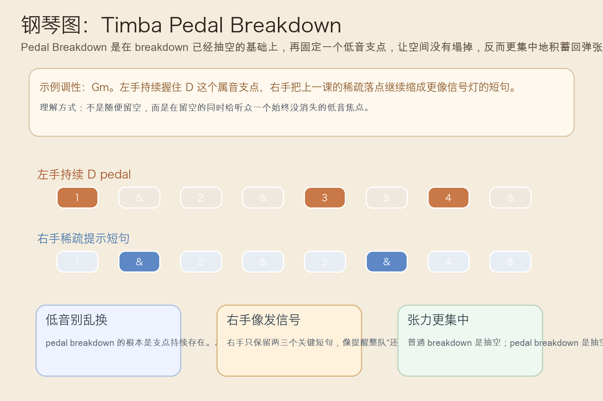
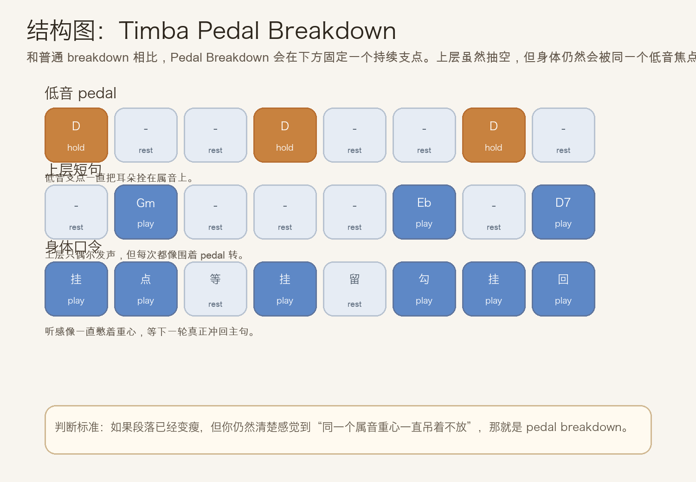
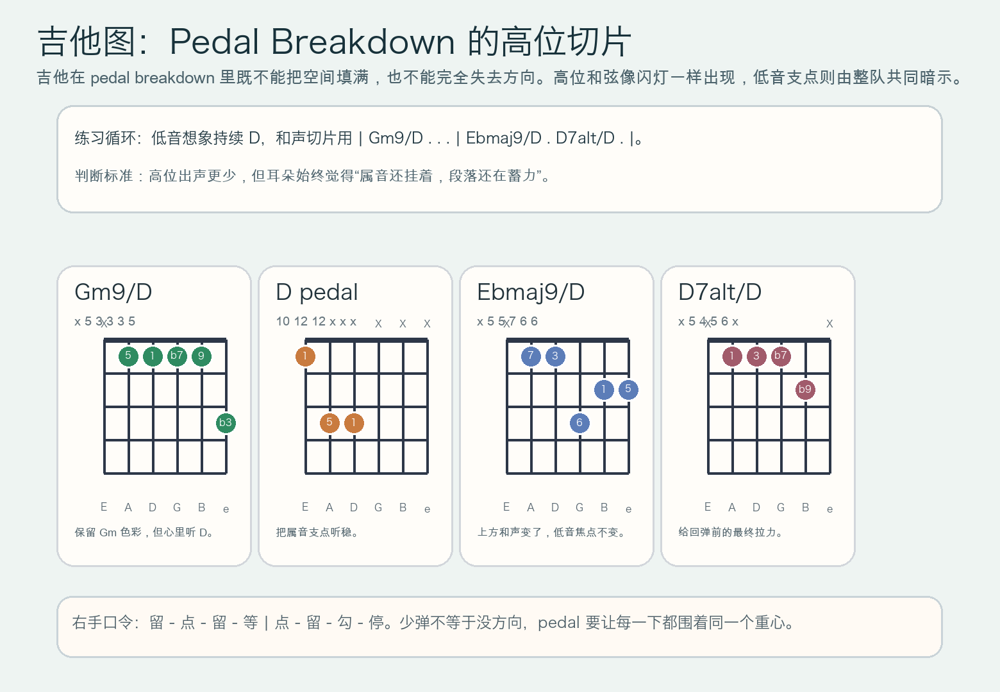

# 2026-07-01：Timba Pedal Breakdown

## 今日知识点

今天只讲一个知识点：**Timba Pedal Breakdown，也就是在 Timba 的 breakdown 段里固定一个低音支点，让编配虽然抽空，但张力不会散掉。**

上一次的 `Timba Breakdown` 讲的是：高位口号喊完以后，主动把编配变瘦，为下一轮重组能量。

今天只再往前推进一步：

**如果已经进入 breakdown 了，但你不想让段落只是“突然变少”，而是想让听众一直被同一个低音重心吊着，怎么办？**

答案就是 `pedal breakdown`。

你可以先把它理解成：

```text
Timba Breakdown：主动抽空编配，为下一轮腾出空间
Timba Pedal Breakdown：抽空的同时固定一个低音支点，让空间感和等待感同时成立
```

它的关键不在“pedal 很多”，而在：

1. 低音焦点持续存在，段落不会因为减法而失去方向。
2. 上层可以更稀疏，因为下方已经有稳定牵引。
3. 它特别适合接在高能段之后，把“蹲下蓄力”改造成“悬着不放”的等待感。
4. 学会它之后，你会更容易听出为什么有些 Timba breakdown 明明音更少，却比普通留空更紧。

今天真正要抓住的是：

**Timba Pedal Breakdown 的核心，不是单纯留空，而是在留空时让同一个低音支点持续牵住整段张力。**





## 钢琴使用场景

钢琴上，`Timba Pedal Breakdown` 很适合放在 **horn hits 或 bloque 已经把场面点亮、普通 breakdown 也已经抽出空间、但编曲还想继续吊着属功能重心、不想立刻把张力放掉** 的场景里。

今天用 `G` 小调做一个入门版两小节循环：

```text
低音 pedal：D - - D - - D -
上层和声：Gm9 . . . | Ebmaj9 . D7alt .
```

钢琴上最关键的是三件事：

1. 左手要先把 `D` 这个 pedal 听稳，别一抽空就忍不住乱换根音。
2. 右手必须更像“提示灯”而不是主角，只在少数落点给出和声信号。
3. 即使音更少，拍感也不能塌；pedal 的价值就是让听众一直知道重心还在。

它尤其适合这样练：

- 左手单独反复弹 `D` 的八分支点
- 右手只在 `& of 1`、`& of 3` 或 `4` 附近给短句
- 先把普通 breakdown 弹一轮，再改成 pedal breakdown，比对“留空但更悬着”的差别

## 吉他使用场景

吉他上，`Timba Pedal Breakdown` 很适合放在 **高位 comping 不再负责撑满编配，而是要围绕同一个低音中心做切片式提示** 的场景里。

今天可以直接套这组思路：

```text
低音重心：持续听 D
高位切片：| Gm9/D . . . | Ebmaj9/D . D7alt/D . |
```

吉他的重点是：

1. 每次出声都要短，像围着 pedal 的闪灯，而不是常规扫弦。
2. 高位和弦虽然变化，但耳朵里要一直听见 `D` 这个属音支点。
3. 右手要把“少”和“稳”同时做到，不能因为音少就失去舞感。

最常见的错误是：

- 留空做到了，但支点没听清，结果只是普通稀疏伴奏
- 和弦一变就跟着改低音感觉，pedal 效果被自己抹掉
- 右手每一下都扫太长，空间和悬挂感同时消失



## 可演奏例子

钢琴例子：

```text
例子 1（左手 pedal 版）
左手：D . . D . . D .
要求：每次 D 都像钉子，把段落重心牢牢钉住。

例子 2（加右手短句）
右手：. Gm9 . . . Ebmaj9 . D7alt
要求：右手像信号提示，不要弹成长线旋律。

例子 3（和上一课对比）
第一轮：普通 breakdown
第二轮：pedal breakdown
要求：听感要从“抽空”变成“抽空但一直悬着不放”。
```

吉他例子：

```text
例子 1（纯右手动作）
口令：留 - 点 - 留 - 等 | 点 - 留 - 勾 - 停
要求：每次出声都短，但节拍不能软。

例子 2（带 pedal 感）
和声：| Gm9/D . . . | Ebmaj9/D . D7alt/D . |
要求：所有高位切片都像围着同一个低音中心转。

例子 3（接上昨天主题）
第一轮：先做 Timba Breakdown
第二轮：把低音固定成 D pedal
要求：感受段落从“留空间”变成“带着属音悬念留空间”。
```

## 今日练习

1. 先拍手数 `1 & 2 & 3 & 4 &`，嘴里持续念 `D`，感受固定重心下的等待感。
2. 钢琴左手单独练 `D . . D . . D .` 两分钟，确保八分脉冲稳定。
3. 再加入右手 `Gm9`、`Ebmaj9`、`D7alt` 的短句提示，故意只弹少数落点。
4. 吉他先全闷音练 `留 - 点 - 留 - 等 | 点 - 留 - 勾 - 停`，再把高位和弦切片放进去。
5. 把昨天的 `Timba Breakdown` 接到今天的 `Timba Pedal Breakdown`：先学会抽空，再学会在抽空里固定重心。

## 一句话总结

Timba Pedal Breakdown 的核心，是在 breakdown 已经变瘦时继续固定低音支点，让整段张力一直悬着、等下一轮更狠地回来。
