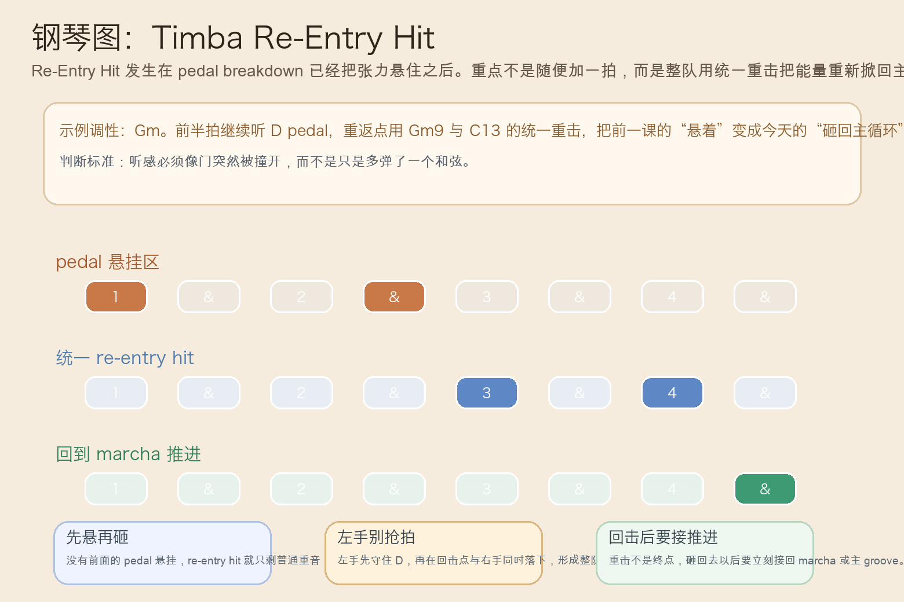
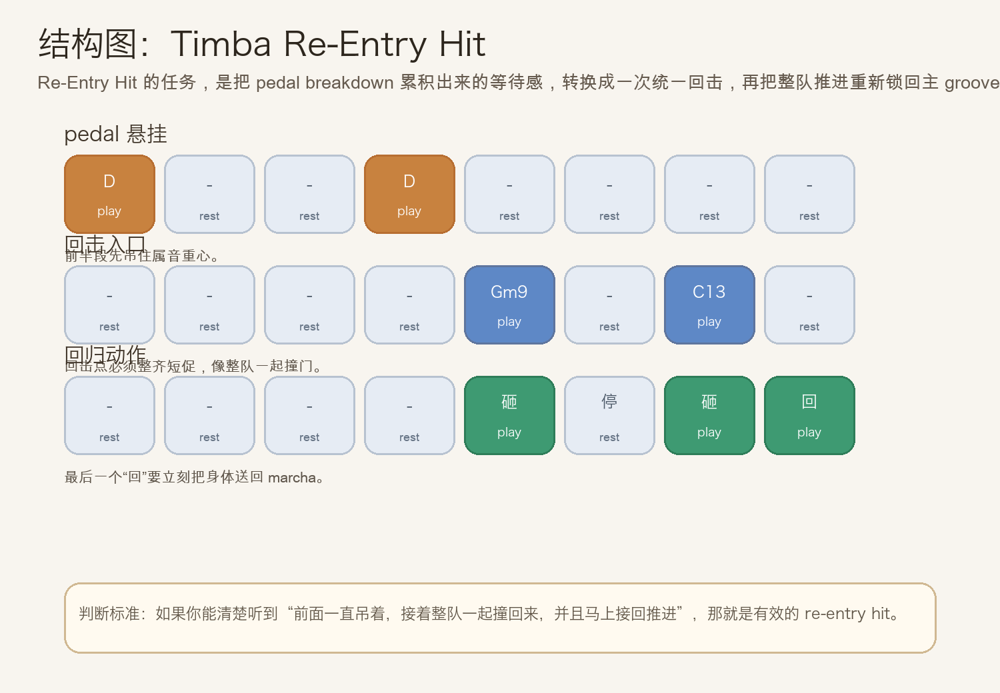
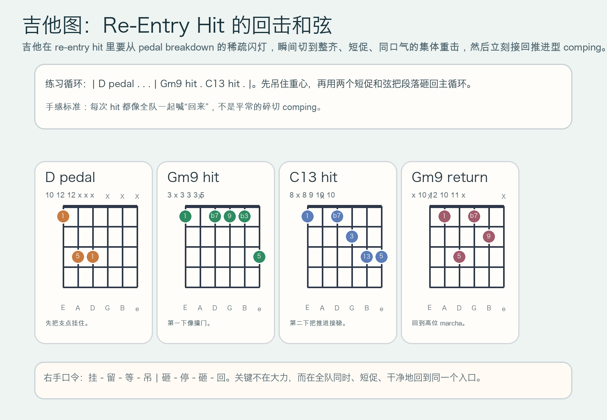

# 2026-07-02：Timba Re-Entry Hit

## 今日知识点

今天只讲一个知识点：**Timba Re-Entry Hit，也就是在 pedal breakdown 把张力悬住以后，整队用一次统一重击把能量重新掀回主循环。**

上一次的 `Timba Pedal Breakdown` 讲的是：在 breakdown 里固定低音支点，让空间感和等待感同时成立。

今天只再往前推进一步：

**如果张力已经被同一个 pedal 吊住了，接下来怎样不是“慢慢回去”，而是让整队像撞门一样一下子回到主 groove？**

答案就是 `re-entry hit`。

你可以先把它理解成：

```text
Timba Pedal Breakdown：抽空同时固定低音支点，让张力一直悬着
Timba Re-Entry Hit：在悬住之后，用统一重击把整队重新砸回主循环
```

它的关键不在“更响”，而在：

1. 前面必须已经有悬挂感，回击才会成立。
2. 回击点必须整齐、短促、同口气，不能像普通伴奏那样零散。
3. hit 之后要立刻接回推进型 groove，而不是停在重音上发呆。
4. 学会它之后，你会更容易听出为什么很多 Timba 段落能在抽空后一下子重新把舞池拉起来。

今天真正要抓住的是：

**Timba Re-Entry Hit 的核心，不是单独的一个重音，而是“悬挂张力 -> 统一回击 -> 立刻回到推进”的完整动作。**





## 钢琴使用场景

钢琴上，`Timba Re-Entry Hit` 很适合放在 **pedal breakdown 已经把属功能重心吊住、全队都在等“回来”这一瞬间、钢琴需要和鼓组/低音一起把入口撞开** 的场景里。

今天用 `G` 小调做一个入门版两小节循环：

```text
前半段：D pedal . . D . . . .
回击点：Gm9 . C13 .
回来后：立刻接回 Gm9 - C13 的 marcha 推进
```

钢琴上最关键的是三件事：

1. 左手在回击前先老实守住 `D`，别提前泄露“要回来了”。
2. 到回击点时，左右手要像整队一起落地，不能一个先一个后。
3. hit 之后别拖长音，马上回到推进型短句，听感才会像真正重返主循环。

它尤其适合这样练：

- 先单独练左手 `D` pedal，两小节里只听“悬着”
- 再把右手 `Gm9`、`C13` 的两个 hit 放进固定落点
- 最后在第二个 hit 后立刻接回 marcha，比较“只打重音”和“重音后真的回来”的差别

## 吉他使用场景

吉他上，`Timba Re-Entry Hit` 很适合放在 **高位 comping 刚经历 pedal breakdown 的留空，下一秒需要和钢琴、铜管、鼓一起同步回击，重新把节奏推满** 的场景里。

今天可以直接套这个思路：

```text
| D pedal . . . | Gm9 hit . C13 hit . |
```

吉他的重点是：

1. 回击前的几下必须足够克制，不然“回来”不会有门被撞开的感觉。
2. hit 的和弦要短、齐、干净，像切片一样落下就收手。
3. 第二个 hit 之后马上回到 marcha comping，别把段落又弹成静止重音。

最常见的错误是：

- 前面没有真的留空，结果回击只像普通 accent
- hit 虽然大，但左右手收不干净，空间被自己糊掉
- 打完重音以后没有立刻回到 groove，整段像卡住而不是重启



## 可演奏例子

钢琴例子：

```text
例子 1（先守住 pedal）
左手：D . . D . . . .
要求：先把“悬着不回”的等待感听稳。

例子 2（加入 re-entry hit）
右手：. . . . Gm9 . C13 .
要求：两个 hit 都要像统一回击，不要像普通切分伴奏。

例子 3（完整动作）
第一轮：pedal breakdown
第二轮：Gm9 hit -> C13 hit -> 立刻回 marcha
要求：听感要像“吊住 -> 撞开 -> 推回去”。
```

吉他例子：

```text
例子 1（纯右手动作）
口令：挂 - 留 - 等 - 吊 | 砸 - 停 - 砸 - 回
要求：最后一个“回”必须明显把身体送回主 groove。

例子 2（带和弦）
和声：| D pedal . . . | Gm9 . C13 . |
要求：Gm9 与 C13 两下都短促，打完立刻接回短切 comping。

例子 3（接上昨天主题）
第一轮：先做 pedal breakdown
第二轮：加入 re-entry hit
要求：感受段落从“悬着不放”变成“整队一起撞回来”。
```

## 今日练习

1. 先拍手数 `1 & 2 & 3 & 4 &`，前半轮只念“挂”，后半轮念“砸 - 停 - 砸 - 回”。
2. 钢琴左手单独练 `D` pedal，两分钟内不要提前加回主和弦。
3. 再加入右手 `Gm9` 与 `C13` 两个回击点，每次打完都立刻收短。
4. 吉他先全闷音练右手口令，再把 `Gm9`、`C13` 放进回击点，确认收手干净。
5. 把昨天的 `Timba Pedal Breakdown` 接到今天的 `Timba Re-Entry Hit`：先学会把张力吊住，再学会把它整队砸回主循环。

## 一句话总结

Timba Re-Entry Hit 的核心，是先让 pedal breakdown 把张力吊住，再用统一短促的回击把整队重新撞回推进中的主 groove。
