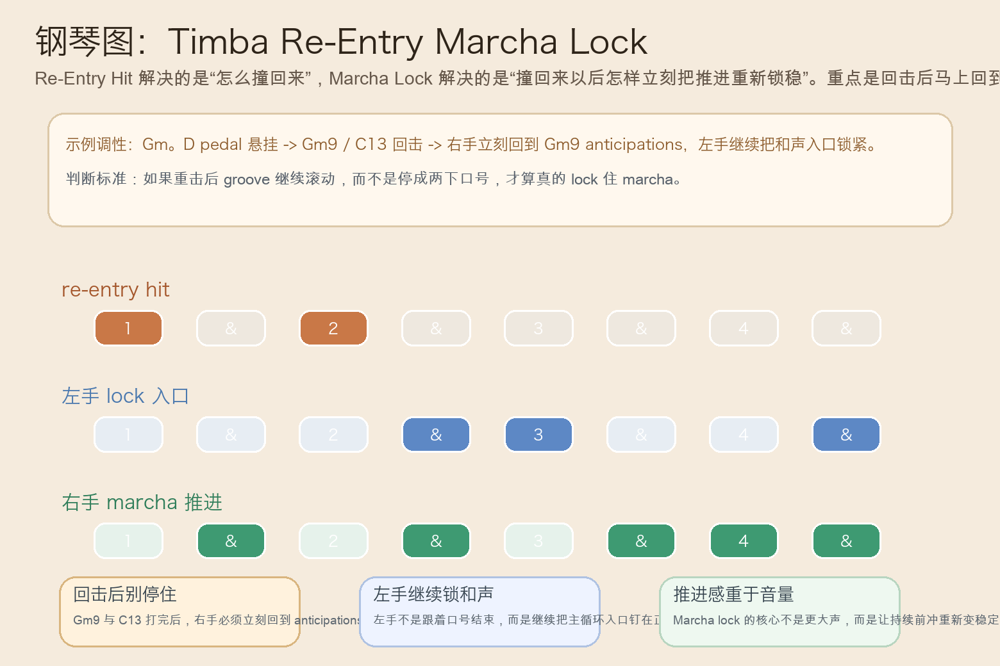
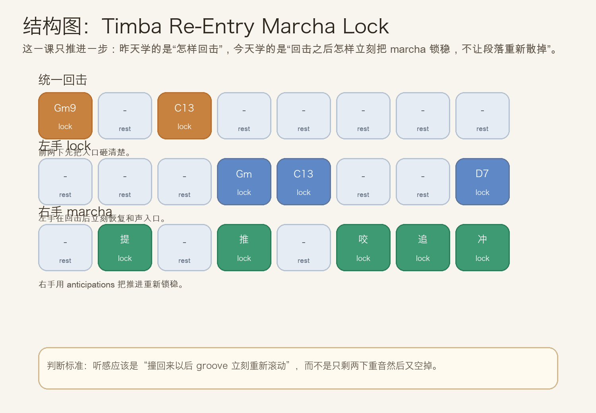
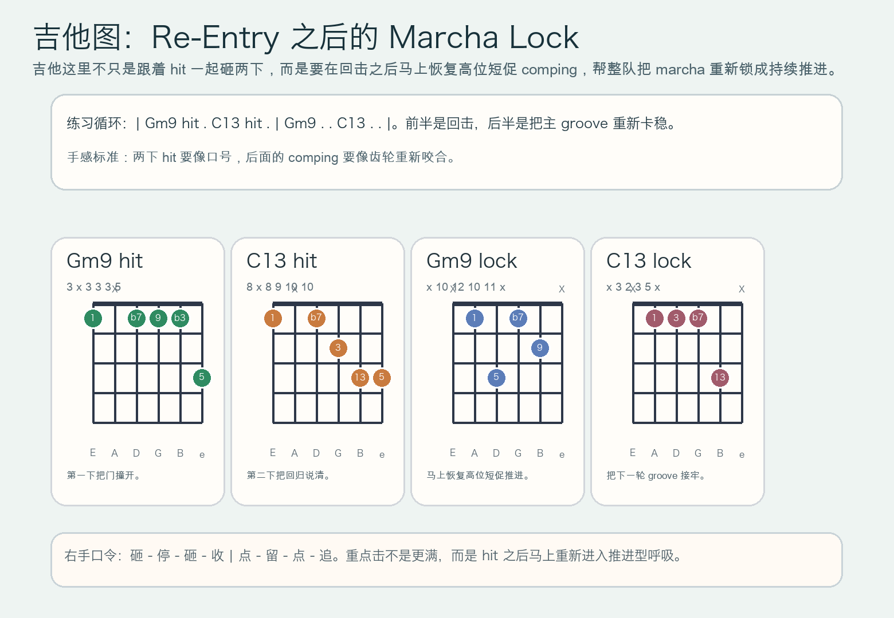

# 2026-07-03：Timba Re-Entry Marcha Lock

## 今日知识点

今天只讲一个知识点：**Timba Re-Entry Marcha Lock，也就是在 re-entry hit 已经把整队撞回主循环之后，立刻用稳定的 marcha 推进把 groove 重新锁住。**

上一次的 `Timba Re-Entry Hit` 讲的是：在 pedal breakdown 把张力吊住以后，用统一重击把能量重新掀回主循环。

今天只再往前推进一步：

**如果已经成功“撞回来了”，接下来怎样避免段落只剩两下重音，而是真正重新滚动起来？**

答案就是 `re-entry marcha lock`。

你可以先把它理解成：

```text
Timba Re-Entry Hit：整队用统一回击把入口撞开
Timba Re-Entry Marcha Lock：入口撞开后，立刻用 marcha 把持续推进重新锁稳
```

它的关键不在“再多弹一点”，而在：

1. 回击之后不能停在口号感，要马上恢复持续推进。
2. 左手或低层入口要重新明确和声支点，不能只剩高位噪点。
3. 右手或高位 comping 要回到 anticipations，而不是继续只打大重音。
4. 学会它之后，你会更容易听出为什么很多 Timba 段落“回来”以后不是一下就结束，而是会立刻重新卷起来。

今天真正要抓住的是：

**Timba Re-Entry Marcha Lock 的核心，不是回击本身，而是回击后的下一秒，整队怎样重新把持续推进咬稳。**





## 钢琴使用场景

钢琴上，`Timba Re-Entry Marcha Lock` 很适合放在 **pedal breakdown 已经悬住、re-entry hit 已经撞开入口、但编曲还需要钢琴立刻把主 groove 重新卡稳** 的场景里。

今天用 `G` 小调做一个入门版两小节循环：

```text
第一拍组：Gm9 hit . C13 hit .
第二拍组：Gm9 . . C13 . . D7alt
```

钢琴上最关键的是三件事：

1. `Gm9` 与 `C13` 两下 hit 要短，像入口口号，不要拖成长音。
2. 回击之后左手要马上继续管和声入口，不能因为“已经回来了”就松掉。
3. 右手要立刻回到 marcha 常见的 anticipations，让推进重新滚动。

它尤其适合这样练：

- 先只练 `Gm9 -> C13` 两下回击，确认入口够整齐。
- 再在回击后补上右手 `&` 拍的推进短句，比较“只回来”与“回来后锁稳”的差别。
- 最后把昨天的 `Re-Entry Hit` 和今天的 `Marcha Lock` 连起来，听见“撞开 -> 滚动”的连续动作。

## 吉他使用场景

吉他上，`Timba Re-Entry Marcha Lock` 很适合放在 **高位 comping 先跟全队完成 re-entry hit，然后立刻恢复短促、持续、咬拍的 marcha 配合** 的场景里。

今天可以直接套这个思路：

```text
| Gm9 hit . C13 hit . | Gm9 . . C13 . . |
```

吉他的重点是：

1. 前两下 hit 要像同一口气喊出来，干净、齐、短。
2. hit 之后右手马上缩回高位短切，不要继续把每一下都弹成重音。
3. 吉他的 lock 不是抢钢琴主线，而是帮整队把重新启动的齿轮卡牢。

最常见的错误是：

- hit 很大，但后面没接回 comping，结果段落又空掉。
- comping 虽然回来了，但拍点比钢琴慢半口气，lock 感就会松。
- 每次出声都太长，听感会从“重新锁稳”变成“重新糊掉”。



## 可演奏例子

钢琴例子：

```text
例子 1（只练回击）
右手：Gm9 . C13 .
要求：两下都短促整齐，像把门撞开。

例子 2（加入 lock）
左手：. . . Gm . . D7
右手：. 提 . 推 . 咬 追 冲
要求：回击后下一秒就要重新出现持续前冲。

例子 3（完整动作）
第一轮：pedal breakdown -> re-entry hit
第二轮：re-entry hit -> marcha lock
要求：听感要从“吊住 -> 撞开”继续推进到“撞开后立刻滚起来”。
```

吉他例子：

```text
例子 1（右手口令）
口令：砸 - 停 - 砸 - 收 | 点 - 留 - 点 - 追
要求：前半是口号，后半是齿轮重新咬合。

例子 2（带和弦）
和声：| Gm9 hit . C13 hit . | Gm9 . . C13 . . |
要求：hit 与 lock 的手感明显不同，前者大而短，后者小而持续。

例子 3（接上昨天主题）
第一轮：只做 Re-Entry Hit
第二轮：在 hit 后立刻恢复 marcha comping
要求：比较“回来”与“回来并锁稳”的差别。
```

## 今日练习

1. 先拍手数 `1 & 2 & 3 & 4 &`，把前四个八分念成“砸 - 停 - 砸 - 收”，后四个念成“点 - 留 - 点 - 追”。
2. 钢琴先单独练 `Gm9 -> C13` 两下回击，再补上右手后半拍推进。
3. 左手加入 `Gm -> C13 -> D7alt` 的入口，确认回击后和声不会散。
4. 吉他先全闷音练右手动作，再把 `Gm9` 与 `C13` 放回高位和弦形状里。
5. 把 `Timba Pedal Breakdown`、`Timba Re-Entry Hit`、`Timba Re-Entry Marcha Lock` 连成一条线：先悬住，再撞回，再锁稳。

## 一句话总结

Timba Re-Entry Marcha Lock 的核心，是在 re-entry hit 把入口撞开以后，立刻用 marcha 的持续推进把整队 groove 重新锁稳。
