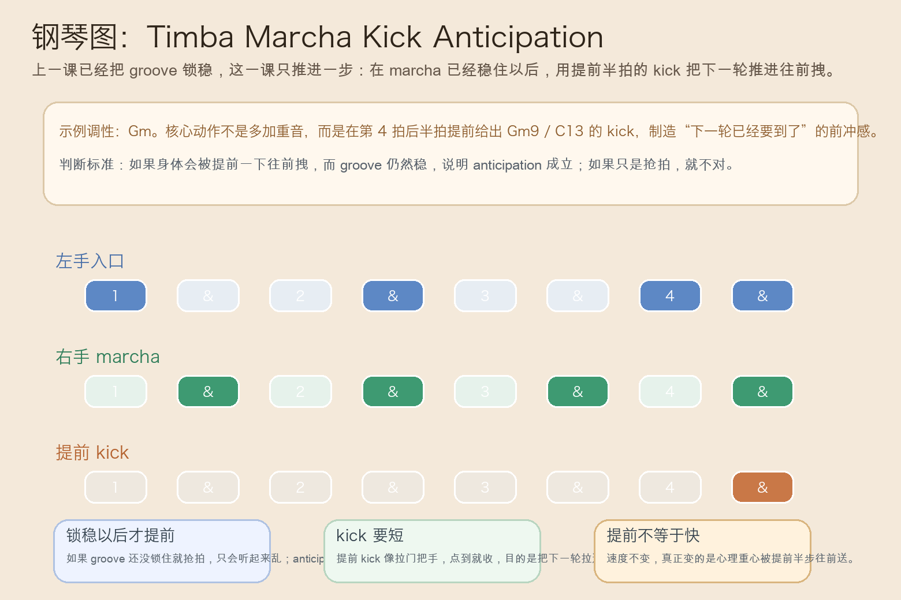
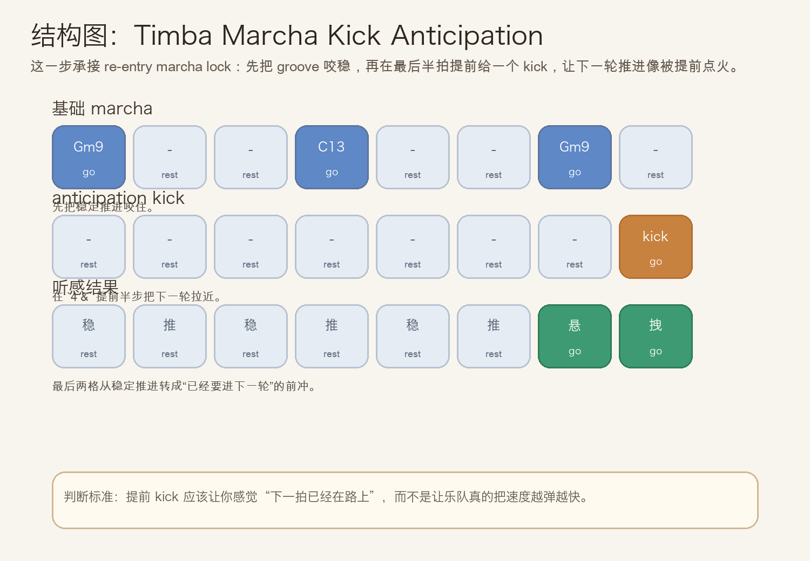
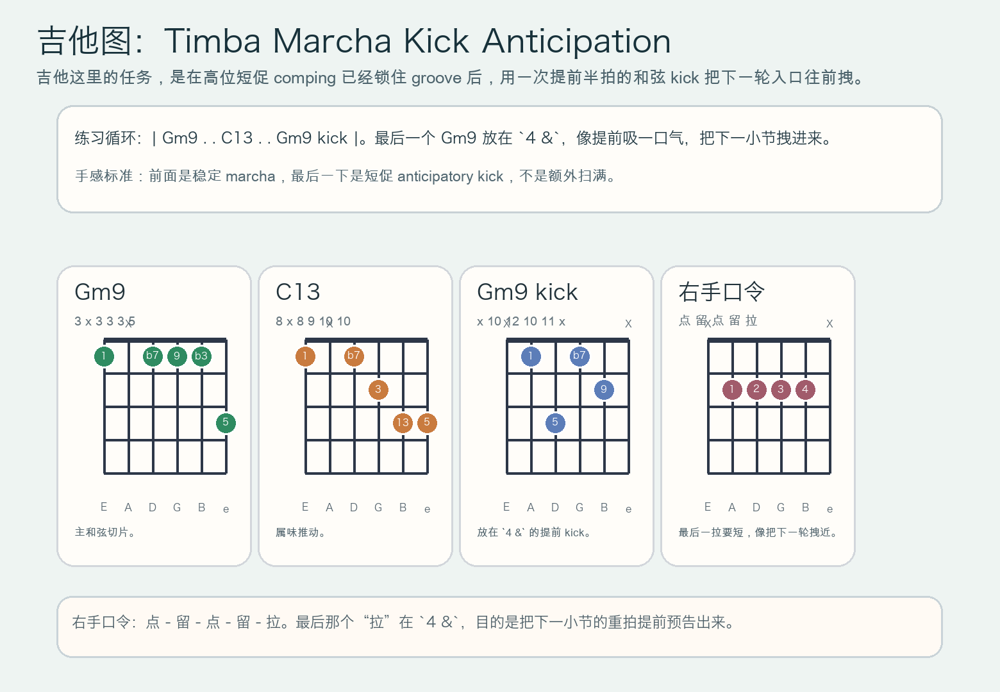

# 2026-07-06：Timba Marcha Kick Anticipation

## 今日知识点

今天只讲一个知识点：**Timba Marcha Kick Anticipation，也就是在 re-entry marcha 已经锁稳之后，用一次提前半拍的 kick 把下一轮 groove 往前拽。**

上一次的 `Timba Re-Entry Marcha Lock` 讲的是：回击把入口撞开后，立刻用 marcha 把持续推进重新锁稳。

今天只再往前推进一步：

**如果 groove 已经锁住了，接下来怎样不是继续“平着走”，而是让整段在不加速的前提下产生更强的前冲感？**

答案就是 `marcha kick anticipation`。

你可以先把它理解成：

```text
Timba Re-Entry Marcha Lock：回击后立刻把 groove 重新锁稳
Timba Marcha Kick Anticipation：groove 已经锁稳后，再用提前半拍的 kick 把下一轮推进往前拉
```

它的关键不在“多打一拍”，而在：

1. 前面的 marcha 必须已经稳定，提前 kick 才会听起来像推动，而不是慌乱。
2. kick 要短、准、集中，像提前拽动下一轮入口。
3. 提前的是心理重心，不是速度；节拍不能越弹越快。
4. 学会它之后，你会更容易听出为什么很多 Timba groove 会让人感觉“下一拍已经在路上”。

今天真正要抓住的是：

**Timba Marcha Kick Anticipation 的核心，不是抢拍，而是在稳定 marcha 里用一次提前半步的 kick 制造前冲。**





## 钢琴使用场景

钢琴上，`Timba Marcha Kick Anticipation` 很适合放在 **re-entry hit 和 marcha lock 都已经完成、主 groove 已经稳定滚动、但编曲还想让下一轮入口再往前拽半口气** 的场景里。

今天用 `G` 小调做一个入门版两小节循环：

```text
基础 marcha：Gm9 . . C13 . . Gm9 .
提前 kick：把最后一个 Gm9 放到 `4 &`
```

钢琴上最关键的是三件事：

1. 左手先把 `Gm -> C13 -> Gm` 的入口踩稳，别还没锁住就急着提前。
2. 右手前半段保持正常 marcha 呼吸，最后一下再给短促 kick。
3. `4 &` 的 kick 打完要立刻收手，让下一小节的 `1` 真正显得被提前拉近。

它尤其适合这样练：

- 先连续弹两轮普通 marcha，确认 groove 已经稳。
- 第三轮只把最后一个和弦提前到 `4 &`，比较“稳推”与“被往前拽”的差别。
- 保持速度器不变，检查自己是不是把 anticipation 弹成了抢拍。

## 吉他使用场景

吉他上，`Timba Marcha Kick Anticipation` 很适合放在 **高位 comping 已经锁住 marcha、整队准备进入下一轮句子、吉他要用短促的提前和弦帮整段再往前送一下** 的场景里。

今天可以直接套这个思路：

```text
| Gm9 . . C13 . . Gm9 kick |
```

吉他的重点是：

1. 前面的 `Gm9` 与 `C13` 要继续保持短促、稳定，不要因为后面要 kick 就把中间弹散。
2. 最后一个 `Gm9 kick` 放在 `4 &`，像把门先拉开一点，不是把下一小节提前整个弹出来。
3. 右手收手必须干净，否则 anticipatory kick 会糊成普通扫弦。

最常见的错误是：

- groove 还没锁稳就急着提前，听起来像拍子不稳。
- 提前 kick 太长，结果把下一拍真正的落地感吃掉。
- 为了“更冲”把整体速度推快，失去 Timba 那种稳中带拽的劲。



## 可演奏例子

钢琴例子：

```text
例子 1（先锁稳 marcha）
左手：Gm . . C13 . . Gm .
右手：. 提 . 推 . 咬 . 留
要求：先把正常推进练稳。

例子 2（加入 anticipation）
左手：Gm . . C13 . . . Gm
右手：. 提 . 推 . 咬 . kick
要求：最后一下放在 `4 &`，像把下一轮提前拉近。

例子 3（和上一课对比）
第一轮：Re-Entry Marcha Lock
第二轮：Marcha Lock + `4 &` kick
要求：感受从“锁稳”变成“锁稳后再往前拽半步”。
```

吉他例子：

```text
例子 1（纯右手动作）
口令：点 - 留 - 点 - 留 - 拉
要求：最后一个“拉”必须短，像预告下一拍。

例子 2（带和弦）
和声：| Gm9 . . C13 . . Gm9 kick |
要求：kick 明显提前，但整条 groove 不能变快。

例子 3（接上昨天主题）
第一轮：只做 Re-Entry Marcha Lock
第二轮：最后加一个 `4 &` 的 anticipatory kick
要求：比较“重新锁稳”与“锁稳后继续前拽”的差别。
```

## 今日练习

1. 先拍手数 `1 & 2 & 3 & 4 &`，把前七格念成“稳 - 推 - 稳 - 推”，最后一格念“拉”。
2. 钢琴先练两分钟普通 `Gm9 -> C13` marcha，不做任何提前动作。
3. 再把最后一个 `Gm9` 移到 `4 &`，确认节拍器不变但身体会被往前送一下。
4. 吉他先全闷音练右手口令，再把 `Gm9` 和 `C13` 放回高位和弦形状里。
5. 把 `Timba Re-Entry Hit`、`Timba Re-Entry Marcha Lock`、`Timba Marcha Kick Anticipation` 连起来：先撞回，再锁稳，再提前半步把下一轮拉近。

## 一句话总结

Timba Marcha Kick Anticipation 的核心，是在 marcha 已经锁稳之后，用 `4 &` 上短促准确的 kick 把下一轮 groove 提前拽到耳朵前面。
