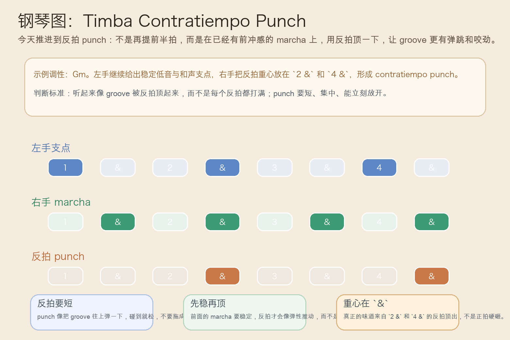
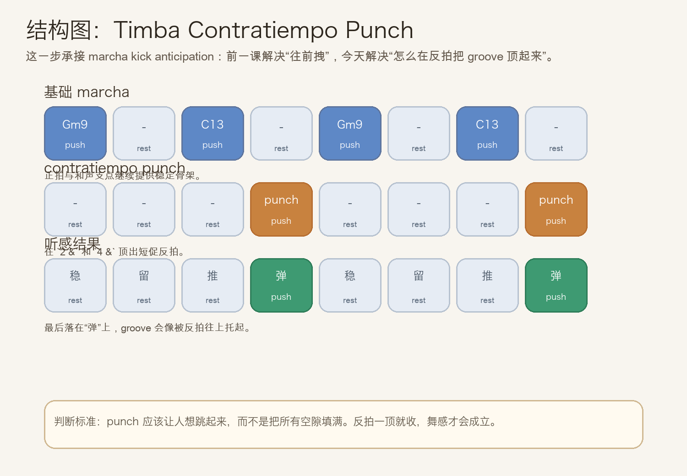
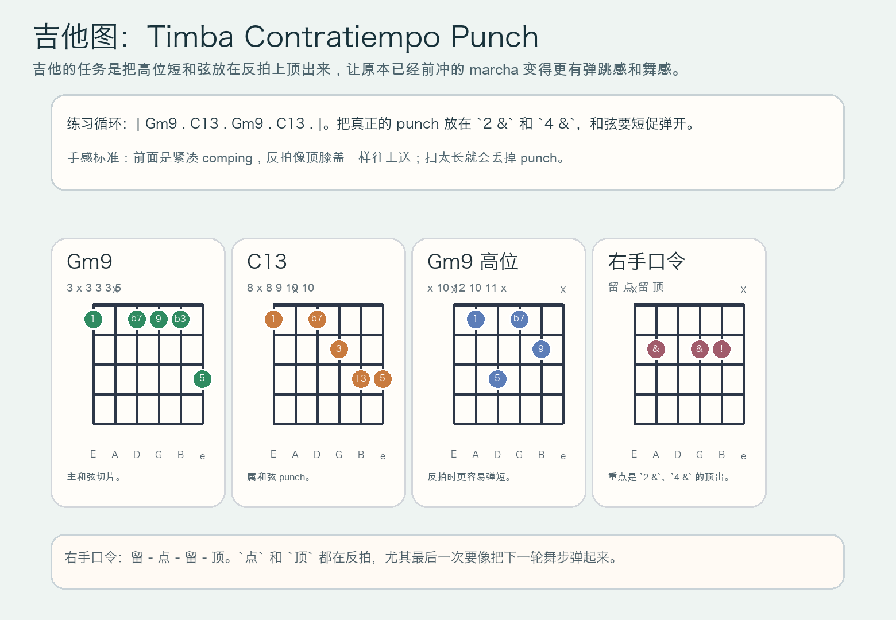

# 2026-07-07：Timba Contratiempo Punch

## 今日知识点

今天只讲一个知识点：**Timba Contratiempo Punch，也就是在 marcha 已经有前冲感之后，用反拍上的短促 punch 把 groove 顶得更有弹跳。**

上一课的 `Timba Marcha Kick Anticipation` 讲的是：在 groove 已经锁稳后，用一次提前半拍的 kick 把下一轮往前拽。

今天再往前推进一步：

**如果前冲感已经有了，怎样让它不只是“往前”，还带一点“往上弹”的感觉？**

答案就是 `contratiempo punch`。

你可以先把它理解成：

```text
Timba Marcha Kick Anticipation：用提前半拍把下一轮往前拽
Timba Contratiempo Punch：用反拍 punch 把已经前冲的 groove 顶出弹跳
```

它的关键不在“打更多”，而在：

1. 前面的 marcha 要先稳，反拍 punch 才像弹性推动。
2. punch 要短、准、立刻松手，像反拍上顶一下。
3. 重心通常落在 `2 &`、`4 &` 这类 `&` 上，而不是把正拍砸重。
4. 学会它以后，你会更容易听出 Timba 为什么总像“边往前拽边往上弹”。

今天真正要抓住的是：

**Timba Contratiempo Punch 的核心，不是抢拍，也不是填满空隙，而是在反拍上给 groove 一个短促的顶力。**





## 钢琴使用场景

钢琴上，`Timba Contratiempo Punch` 很适合放在 **marcha 已经稳定滚动、kick anticipation 已经把句子往前拉起来、这时想让律动更有弹性和咬劲** 的场景里。

今天用 `G` 小调做一个入门版一小节循环：

```text
左手支点：Gm9 . C13 . Gm9 . C13 .
右手 punch：把明显重心放在 `2 &` 和 `4 &`
```

钢琴上最关键的是三件事：

1. 左手继续保持稳定支点，不要因为要打 punch 就把低音推乱。
2. 右手前面照常做 marcha 呼吸，到 `2 &`、`4 &` 再短促顶一下。
3. 每次 punch 后立刻放开，让反拍的弹性自己跳出来，而不是拖成长音。

它尤其适合这样练：

- 先弹两轮普通 marcha，只保留稳定推进。
- 第三轮开始把右手重心移到 `2 &` 和 `4 &`。
- 节拍器不变，比较“只往前推”和“反拍弹起来”的差别。

## 吉他使用场景

吉他上，`Timba Contratiempo Punch` 很适合放在 **高位 comping 已经咬住 groove，乐队希望用更跳的反拍让舞感立起来** 的场景里。

今天可以直接套这个思路：

```text
| Gm9 . C13 . Gm9 . C13 . |
重点：`2 &`、`4 &` 顶出短促反拍
```

吉他的重点是：

1. 和弦要短，反拍 punch 要像手腕一弹，不是整条扫弦拖过去。
2. 前半段 comping 要紧凑，不能为了 punch 把其余位置都弹散。
3. 反拍一出来就松手，留下空气，舞感才会成立。

最常见的错误是：

- 把所有 `&` 都打重，结果变成忙乱。
- punch 太长，听起来像普通切分扫弦。
- 为了“更炸”把正拍和反拍都砸满，失去 contratiempo 的弹性。



## 可演奏例子

钢琴例子：

```text
例子 1（先保留稳定 marcha）
左手：Gm9 . C13 . Gm9 . C13 .
右手：. 留 . 留 . 留 . 留
要求：只感受稳定推进。

例子 2（加入 contratiempo punch）
左手：Gm9 . C13 . Gm9 . C13 .
右手：. 留 . punch . 留 . punch
要求：`2 &` 和 `4 &` 要短促顶出，马上收掉。

例子 3（和上一课对比）
第一轮：Marcha Kick Anticipation
第二轮：保持同样速度，再把重心改成 `2 &`、`4 &` 的 punch
要求：感受“往前拽”与“往上弹”的差别。
```

吉他例子：

```text
例子 1（纯右手动作）
口令：留 - 点 - 留 - 顶
要求：点和顶都放在反拍，动作短。

例子 2（带和弦）
和声：| Gm9 . C13 . Gm9 . C13 . |
要求：`2 &`、`4 &` 的 C13 或高位切片要弹开。

例子 3（接上昨天主题）
第一轮：最后做一次 anticipation kick
第二轮：改为连续的反拍 punch
要求：比较“句尾前拽”和“整段弹跳”的区别。
```

## 今日练习

1. 先拍手数 `1 & 2 & 3 & 4 &`，把 `2 &` 和 `4 &` 拍得更短、更弹。
2. 钢琴先练两分钟不带 punch 的 `Gm9 -> C13` marcha，再加反拍重心。
3. 吉他先全闷音练右手口令 `留 - 点 - 留 - 顶`，确保每次顶完都能立刻停住。
4. 把 `Timba Re-Entry Marcha Lock`、`Timba Marcha Kick Anticipation`、`Timba Contratiempo Punch` 连起来：先锁稳，再前拽，再反拍顶起。
5. 录一段自己弹的循环，回听 punch 是否真的只在反拍上短促出现，而不是全程都在猛扫。

## 一句话总结

Timba Contratiempo Punch 的核心，是在 marcha 已经前冲起来之后，用 `2 &`、`4 &` 上短促准确的反拍 punch 把 groove 顶出弹跳感。
