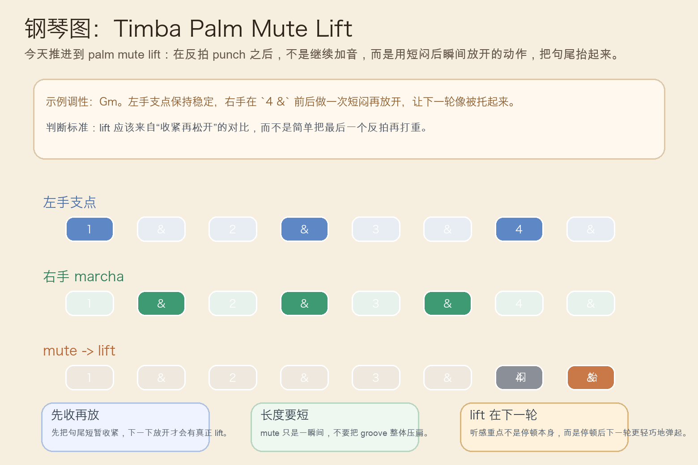
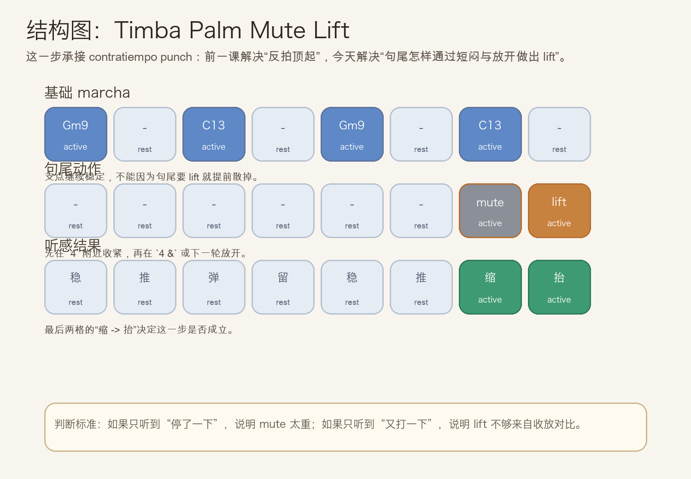
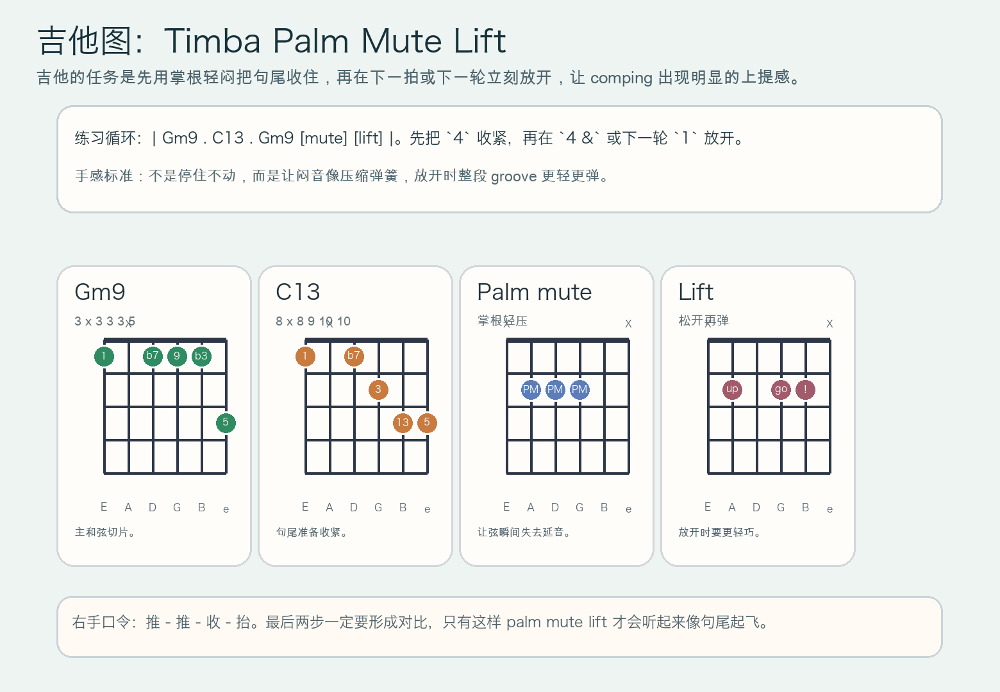

# 2026-07-08：Timba Palm Mute Lift

## 今日知识点

今天只讲一个知识点：**Timba Palm Mute Lift，也就是在反拍 punch 已经建立弹跳之后，用一次短闷再放开的动作，把句尾和下一轮之间的 lift 做出来。**

上一课的 `Timba Contratiempo Punch` 讲的是：在 marcha 已经往前滚动时，用 `2 &`、`4 &` 的短促反拍把 groove 顶出弹跳。

今天再往前推进一步：

**如果反拍已经会弹了，怎样让整段 groove 在句尾像被“轻轻抬起来”一样进入下一轮？**

答案就是 `palm mute lift`。

你可以先把它理解成：

```text
Timba Contratiempo Punch：用反拍顶一下，让 groove 弹起来
Timba Palm Mute Lift：先短闷一下，再立刻放开，让句尾与下一轮像被抬起来
```

它的关键不在“停一下”，而在：

1. mute 要短，只是瞬间收紧，不是把律动压死。
2. lift 要立刻跟上，听感重点在“放开后更轻更弹”。
3. 句尾的收与放必须形成对比，否则只会像普通切分。
4. 学会它以后，你会更容易听出 Timba 编配为什么常常在句尾突然有一种“起飞感”。

今天真正要抓住的是：

**Timba Palm Mute Lift 的核心，不是多一个音，而是用“收紧 -> 放开”的对比把下一轮托起来。**





## 钢琴使用场景

钢琴上，`Timba Palm Mute Lift` 很适合放在 **marcha 已经锁住、反拍 punch 也已经会弹、这时想让句尾不要只是结束，而是轻轻把下一轮抬出来** 的场景里。

今天用 `G` 小调做一个一小节循环：

```text
左手支点：Gm9 . C13 . Gm9 . C13 .
右手句尾：前面保持 marcha，最后在 `4` 附近短闷一下，`4 &` 或下一轮 `1` 立刻放开
```

钢琴上最关键的是三件事：

1. 左手继续保持稳定支点，不要因为句尾要做 lift 就把低音乱掉。
2. 右手在句尾的 mute 要非常短，像吸一口气，而不是突然停止。
3. 放开时手指要更轻，让下一轮自然浮起来，而不是硬砸回正拍。

它尤其适合这样练：

- 先弹两轮普通 marcha，只保留稳定推进。
- 第三轮加入 contratiempo punch。
- 第四轮在句尾加一次短闷再放开，比较“只是弹”和“弹完被抬起来”的差别。

## 吉他使用场景

吉他上，`Timba Palm Mute Lift` 很适合放在 **高位 comping 已经有反拍弹跳，乐队希望句尾出现更明显的收放层次** 的场景里。

今天可以直接套这个思路：

```text
| Gm9 . C13 . Gm9 [mute] [lift] |
重点：掌根短压让弦瞬间失去延音，再立刻松开进入下一轮
```

吉他的重点是：

1. palm mute 只压一下，让和弦缩短，不要闷成完全没有弹性。
2. 放开之后的下一下要更轻更快，像把 groove 弹出去。
3. 整段 comping 还是要紧，不能为了句尾效果把前面都弹散。

最常见的错误是：

- mute 太长，整段 groove 像被刹车。
- lift 还是用重扫，结果听不出“抬起来”，只听到“又打重了一下”。
- 前面没有稳定的 marcha，句尾的收放就会显得突兀。



## 可演奏例子

钢琴例子：

```text
例子 1（先保留稳定 marcha）
左手：Gm9 . C13 . Gm9 . C13 .
右手：. 留 . punch . 留 . 留
要求：先让前面的呼吸稳定。

例子 2（加入 palm mute lift）
左手：Gm9 . C13 . Gm9 . C13 .
右手：. 留 . punch . 留 . mute -> lift
要求：最后一下不是更重，而是更轻地被抬出。

例子 3（和上一课对比）
第一轮：只有 Contratiempo Punch
第二轮：保持速度不变，在句尾加入短闷再放开
要求：感受“反拍弹跳”与“句尾起飞”的区别。
```

吉他例子：

```text
例子 1（纯右手动作）
口令：推 - 推 - 收 - 抬
要求：`收` 要短，`抬` 要马上跟上。

例子 2（带和弦）
和声：| Gm9 . C13 . Gm9 [mute] [lift] |
要求：C13 后半拍掌根轻压，下一下立刻松开。

例子 3（接上昨天主题）
第一轮：`2 &`、`4 &` 正常做 punch
第二轮：保留前面 punch，只在句尾增加 mute -> lift
要求：比较“整段在弹”与“句尾被托起来”的差别。
```

## 今日练习

1. 先拍手数 `1 & 2 & 3 & 4 &`，在 `4` 做一次短收，再在 `4 &` 或下一轮轻轻放开。
2. 钢琴先练两分钟 `Gm9 -> C13` 的普通 marcha，再加入一句句尾 mute -> lift。
3. 吉他先全闷音练右手口令 `推 - 推 - 收 - 抬`，确认最后两步长度明显不同。
4. 把 `Timba Marcha Kick Anticipation`、`Timba Contratiempo Punch`、`Timba Palm Mute Lift` 连起来：先前拽，再反拍顶起，最后句尾抬出。
5. 录一段自己的循环，回听最后一拍是否真有“收紧后更轻地弹起”的对比。

## 一句话总结

Timba Palm Mute Lift 的核心，是在反拍 punch 已经成立之后，用一句句尾的短闷再放开，把下一轮 groove 轻巧地托起来。
