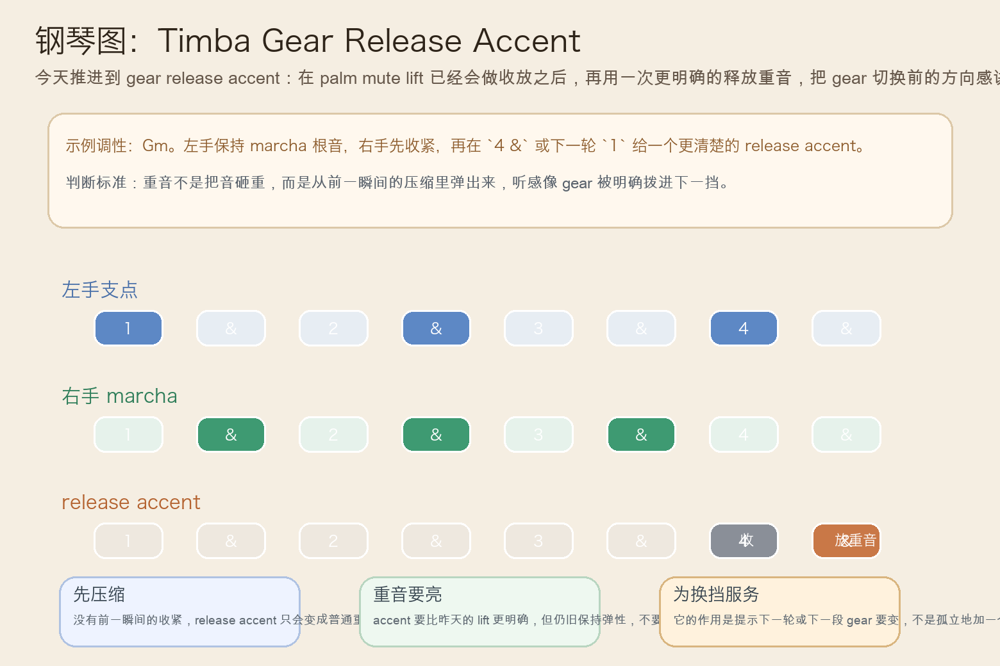
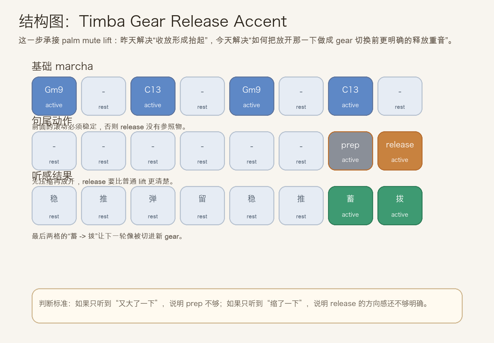
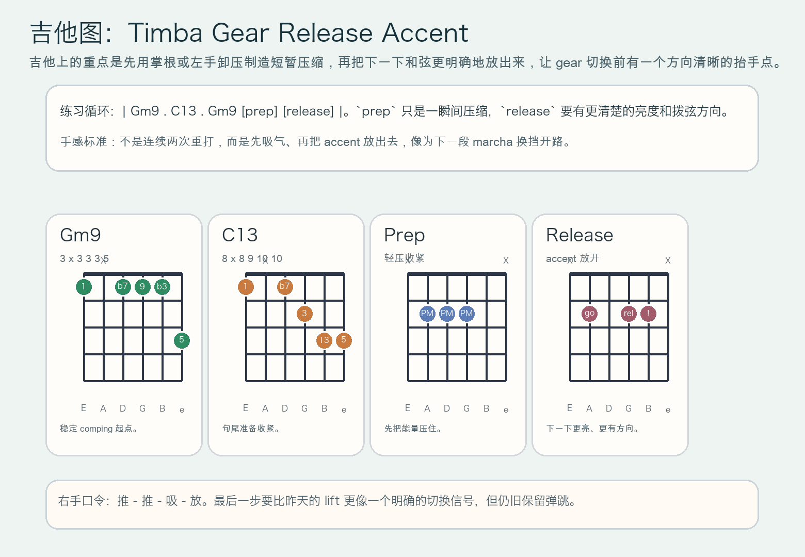

# 2026-07-09：Timba Gear Release Accent

## 今日知识点

今天只讲一个知识点：**Timba Gear Release Accent，也就是在句尾已经会做 `palm mute lift` 的基础上，再把“放开”的那一下做成更明确的释放重音，让下一轮或下一段 gear 切换更有方向感。**

上一课的 `Timba Palm Mute Lift` 讲的是：先短闷一下，再立刻放开，让句尾与下一轮之间出现被“抬起来”的感觉。

今天再往前推进一步：

**如果句尾已经能被抬起来，怎样让这一下不只是“轻轻放开”，而是明确告诉乐队“下一挡要来了”？**

答案就是 `gear release accent`。

你可以先把它理解成：

```text
Timba Palm Mute Lift：先收再放，让句尾被托起来
Timba Gear Release Accent：在收放成立后，把“放开”做成更清楚的释放重音，像把 gear 明确拨进下一挡
```

它的关键不在单纯“更大声”，而在：

1. 前一瞬间必须先有压缩或收紧，否则后面的 accent 没有弹出参照。
2. release 要更亮、更有方向，但不能把 groove 砸扁。
3. accent 的作用是提示 gear 切换、句法转向或下一轮推进，不是孤立加一个重拍。
4. 学会它以后，你会更容易听出 Timba 编配里为什么常在句尾突然像“挂上更快的一挡”。

今天真正要抓住的是：

**Timba Gear Release Accent 的核心，不是最后多一个大音，而是让“压缩 -> 释放”的对比变成一个明确的换挡信号。**





## 钢琴使用场景

钢琴上，`Timba Gear Release Accent` 很适合放在 **marcha 已经锁住、句尾 lift 也已经能做出来、这时想把下一轮推进或 gear 变化说得更明确** 的场景里。

今天用 `G` 小调做一个一小节循环：

```text
左手支点：Gm9 . C13 . Gm9 . C13 .
右手句尾：前面保持 marcha，最后先短收一下，再在 `4 &` 或下一轮 `1` 给一个更亮的 release accent
```

钢琴上最关键的是三件事：

1. 左手继续保持低音与支点稳定，不能因为最后要 accent 就提前抢拍。
2. 右手的 prep 要短，像吸一口气；accent 要亮，像把能量往前送出去。
3. release accent 是“弹出来”，不是“砸出来”，所以触键要干净而不是蛮力。

它尤其适合这样练：

- 先弹两轮普通 marcha，保持稳定滚动。
- 第三轮加入 `palm mute lift`。
- 第四轮把 lift 的“放开”改成更清楚的 release accent，比较“轻抬”和“明确换挡”的区别。

## 吉他使用场景

吉他上，`Timba Gear Release Accent` 很适合放在 **高位 comping 已经有弹跳，句尾想从普通 lift 进一步推进成更明确的 gear 切换提示** 的场景里。

今天可以直接套这个思路：

```text
| Gm9 . C13 . Gm9 [prep] [release] |
重点：掌根或左手先让和弦短暂压缩，再把下一下和弦更亮地放出来
```

吉他的重点是：

1. `prep` 只负责压缩，不负责制造一个很大的闷音。
2. `release` 要有更明确的亮度和拨弦方向，但别把整个时值扫散。
3. 前面的 comping 要持续锁紧，否则最后的 accent 会像单独跳出来的杂音。

最常见的错误是：

- 没有 prep，结果只是在句尾突然打重一下。
- release 太猛，听起来像 rock 式重拍，而不是 Timba 的前冲换挡。
- 前面的 groove 不稳定，导致最后一下没有“从压缩里弹出”的感觉。



## 可演奏例子

钢琴例子：

```text
例子 1（先保留普通 lift）
左手：Gm9 . C13 . Gm9 . C13 .
右手：. 留 . punch . 留 . mute -> lift
要求：先让昨天的句尾抬起感成立。

例子 2（把 lift 升级成 release accent）
左手：Gm9 . C13 . Gm9 . C13 .
右手：. 留 . punch . 留 . prep -> release
要求：最后一下更亮，但不能更重到失去弹性。

例子 3（比较两种句尾）
第一轮：普通 palm mute lift
第二轮：gear release accent
要求：听出第二轮更像“要切到下一挡”，而不只是“轻轻放开”。
```

吉他例子：

```text
例子 1（纯右手动作）
口令：推 - 推 - 吸 - 放
要求：`吸` 很短，`放` 要有方向感。

例子 2（带和弦）
和声：| Gm9 . C13 . Gm9 [prep] [release] |
要求：先轻压一下，再把下一下和弦更清楚地拨出来。

例子 3（接上昨天主题）
第一轮：只做 palm mute lift
第二轮：保留前面的收放，但让最后 release 更亮更明确
要求：比较“抬起来”和“明确切 gear”的差别。
```

## 今日练习

1. 先拍手数 `1 & 2 & 3 & 4 &`，在 `4` 做一次短收，在 `4 &` 做一次明显但不粗暴的释放重音。
2. 钢琴先练两分钟 `Gm9 -> C13` 的普通 marcha，再把最后一句从 lift 升级成 release accent。
3. 吉他先全闷音练右手口令 `推 - 推 - 吸 - 放`，确认最后一步比昨天更亮，但没有失去紧凑度。
4. 把 `Timba Marcha Kick Anticipation`、`Timba Contratiempo Punch`、`Timba Palm Mute Lift`、`Timba Gear Release Accent` 连起来：先前拽，再反拍顶起，再句尾收放，最后明确换挡。
5. 录一段自己的循环，回听最后一下是否听起来像“从压缩里弹出一个方向明确的信号”。

## 一句话总结

Timba Gear Release Accent 的核心，是在句尾收放已经成立之后，把“放开”做成一个更明确的释放重音，让下一轮 groove 像被切进了新的 gear。
