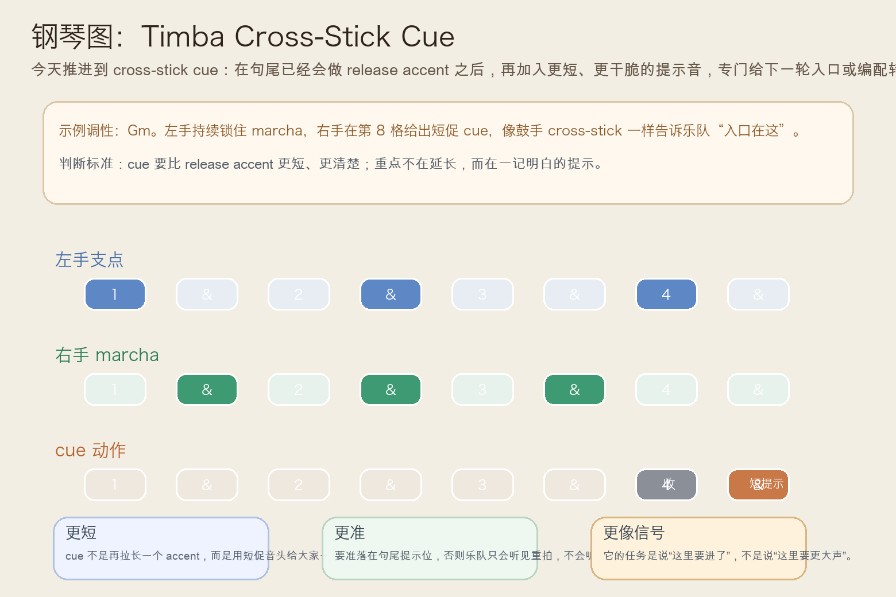
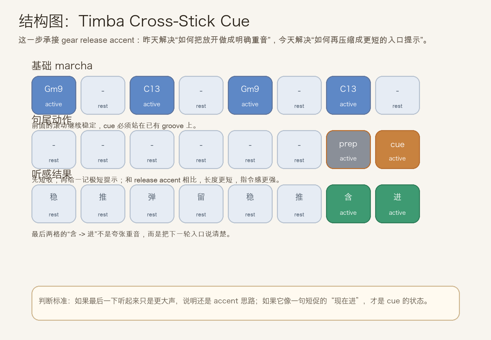
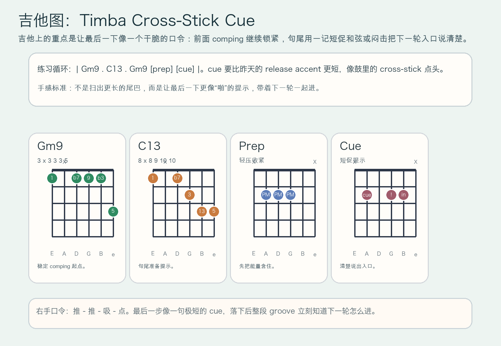

# 2026-07-10：Timba Cross-Stick Cue

## 今日知识点

今天只讲一个知识点：**Timba Cross-Stick Cue，也就是在句尾已经会做 `gear release accent` 的基础上，再把最后的提示收得更短、更像一句明确的入口口令。**

昨天的 `Timba Gear Release Accent` 讲的是：先有短暂压缩，再把“放开”的那一下做成更明确的释放重音，让下一轮或下一段 gear 切换更有方向感。

今天再往前推进一步：

**如果换挡方向已经讲清楚了，怎样让乐队更立刻听懂“就是这里进”？**

答案就是 `cross-stick cue`。

你可以先把它理解成：

```text
Timba Gear Release Accent：把句尾放开做成明确释放重音
Timba Cross-Stick Cue：再把这个句尾提示压缩得更短，像一句专门指向入口的口令
```

它的关键不在“更响”，而在：

1. 前面的 groove 必须已经锁稳，否则最后的 cue 没有参照。
2. cue 必须比普通 accent 更短、更干脆，像鼓手用 cross-stick 点一下。
3. 它的作用是告诉乐队“这里进、这里换、这里转”，不是单纯加重最后一拍。
4. 学会它以后，你会更容易听出 Timba 编配里那些看似很小、但非常像指挥手势的末尾提示。

今天真正要抓住的是：

**Timba Cross-Stick Cue 的核心，不是句尾再打一记重音，而是用一个极短的提示把下一轮入口说清楚。**





## 钢琴使用场景

钢琴上，`Timba Cross-Stick Cue` 很适合放在 **marcha 已经稳定、句尾 release accent 也会做、这时想把下一轮入口或编配转折说得更像一个清楚的提示** 的场景里。

今天用 `G` 小调做一个一小节循环：

```text
左手支点：Gm9 . C13 . Gm9 . C13 .
右手句尾：前面保持 marcha，最后先短收一下，再在 `4 &` 给一个短促 cue
```

钢琴上最关键的是三件事：

1. 左手继续保持低音与支点稳定，不能因为最后要 cue 就提前抢拍。
2. 右手的 prep 要像吸一口气，cue 要像一句很短的“进”。
3. cue 触键要干净、短促、方向明确，而不是拖长或砸重。

它尤其适合这样练：

- 先弹两轮普通 marcha，保持稳定滚动。
- 第三轮加入 `gear release accent`。
- 第四轮把最后那一下再压短，练成更像口令的 `cross-stick cue`。

## 吉他使用场景

吉他上，`Timba Cross-Stick Cue` 很适合放在 **高位 comping 已经有弹跳，句尾想从 release accent 进一步推进成“整队一起进”的提示** 的场景里。

今天可以直接套这个思路：

```text
| Gm9 . C13 . Gm9 [prep] [cue] |
重点：掌根或左手先让和弦短暂压缩，再用一记短促和弦或闷击把入口说清楚
```

吉他的重点是：

1. `prep` 只负责把能量含住，不负责做很大的闷击。
2. `cue` 要比昨天的 release accent 更短，像“啪”地一下提示大家进来。
3. 前面的 comping 要继续锁紧，否则最后一下只会像孤立杂音。

最常见的错误是：

- 没有 prep，结果句尾只是突然更大声。
- cue 太长，听起来像延长 accent，而不是入口提示。
- 前面的 groove 不稳定，导致最后一下没有“指挥信号”的效果。



## 可演奏例子

钢琴例子：

```text
例子 1（先保留昨天的 release accent）
左手：Gm9 . C13 . Gm9 . C13 .
右手：. 留 . punch . 留 . prep -> release
要求：先让昨天的换挡方向感成立。

例子 2（把最后一下压成 cue）
左手：Gm9 . C13 . Gm9 . C13 .
右手：. 留 . punch . 留 . prep -> cue
要求：最后一下更短、更像“这里进”。

例子 3（比较两种句尾）
第一轮：gear release accent
第二轮：cross-stick cue
要求：听出第二轮更像清楚地招呼大家一起进下一轮。
```

吉他例子：

```text
例子 1（纯右手动作）
口令：推 - 推 - 吸 - 点
要求：`点` 要短而准，不拖尾。

例子 2（带和弦）
和声：| Gm9 . C13 . Gm9 [prep] [cue] |
要求：先轻压一下，再用一记短促和弦把下一轮入口说清楚。

例子 3（接上昨天主题）
第一轮：只做 release accent
第二轮：保留前面的收放，但让最后一下缩成 cue
要求：比较“方向感”和“入口提示感”的差别。
```

## 今日练习

1. 先拍手数 `1 & 2 & 3 & 4 &`，在 `4` 做一次短收，在 `4 &` 做一次极短但明确的提示音。
2. 钢琴先练两分钟 `Gm9 -> C13` 的普通 marcha，再把最后一句从 release accent 升级成 cross-stick cue。
3. 吉他先全闷音练右手口令 `推 - 推 - 吸 - 点`，确认最后一步短、准、像一句口令。
4. 把 `Timba Contratiempo Punch`、`Timba Palm Mute Lift`、`Timba Gear Release Accent`、`Timba Cross-Stick Cue` 连起来：先顶起，再收放，再明确换挡，最后清楚发出入口提示。
5. 录一段自己的循环，回听最后一下是否真的像“这里一起进”，而不是只是“这里更大声”。

## 一句话总结

Timba Cross-Stick Cue 的核心，是把句尾已经成立的 release accent 再压缩成一句更短、更明确的入口提示，让下一轮 groove 一听就知道该从哪里进。
