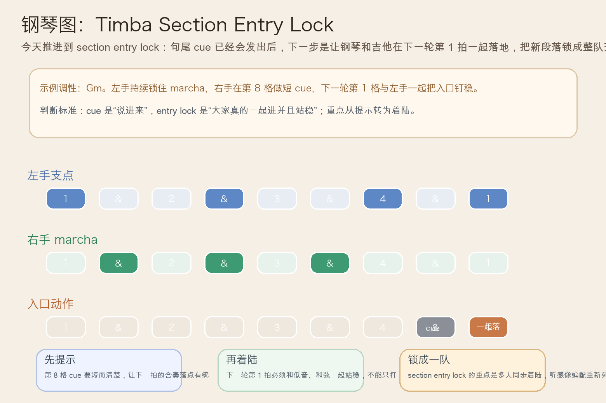
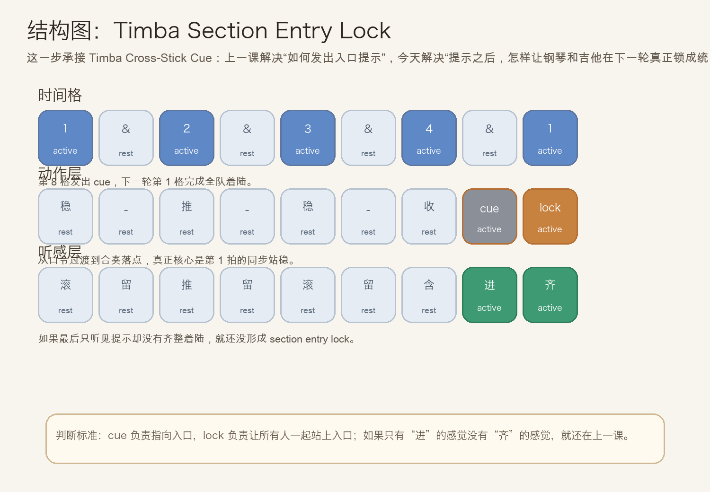
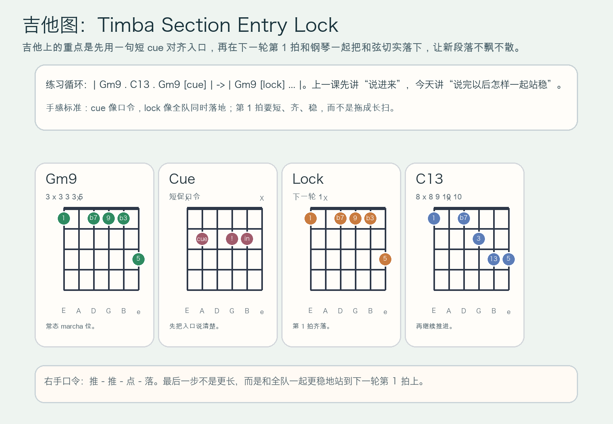

# 2026-07-13：Timba Section Entry Lock

## 今日知识点

今天只讲一个知识点：**Timba Section Entry Lock，也就是在句尾已经会发出 `cross-stick cue` 之后，让钢琴和吉他在下一轮第 1 拍一起落地，把新段落入口锁成整队齐进的着陆点。**

上一课的 `Timba Cross-Stick Cue` 讲的是：把句尾提示压得很短，像一句明确的“这里进”口令。

今天再往前推进一步：

**如果口令已经发出去了，怎样让乐队不是“差不多进来”，而是“齐刷刷一起落在同一个点上”？**

答案就是 `section entry lock`。

你可以先把它理解成：

```text
Timba Cross-Stick Cue：把入口说清楚
Timba Section Entry Lock：说清楚之后，让大家在下一轮第 1 拍一起站稳
```

它的关键不在“再打一记更重的音”，而在：

1. 前一拍的 cue 只是提示，不是结论。
2. 真正决定入口有没有锁住的是下一轮 `1` 的同步着陆。
3. 钢琴、吉他和低音的落点要短、齐、稳，不能拖成长音。
4. 学会它以后，你会更容易听出 Timba 编配里为什么有些入口像“整队一脚踩下去”。

今天真正要抓住的是：

**Timba Section Entry Lock 的核心，不是句尾那一下 cue，而是 cue 之后全队在下一轮第 1 拍的统一着陆。**





## 钢琴使用场景

钢琴上，`Timba Section Entry Lock` 很适合放在 **句尾已经能用 cue 指向入口，接下来要把下一轮 groove 或新段落真正锁成统一落点** 的场景里。

今天用 `G` 小调做一个入门版循环：

```text
前半轮：Gm9 . C13 . Gm9 . cue
下一轮：Gm9 在第 1 拍和左手一起齐落
```

钢琴上最关键的是三件事：

1. 左手低音要继续提供稳定地板，不能被句尾 cue 带跑。
2. 右手 cue 要短，真正的重量放在下一轮 `1` 的整齐落点上。
3. 第 1 拍落下后要立刻重新回到 marcha 呼吸，而不是把入口拖成一块厚重长音。

它尤其适合这样练：

- 先弹两轮普通 marcha，只保留稳定滚动。
- 第三轮在句尾加入 `cross-stick cue`。
- 第四轮要求自己在下一轮 `1` 明确、整齐地和左手一起着陆。

## 吉他使用场景

吉他上，`Timba Section Entry Lock` 很适合放在 **高位 comping 已经会发口令，接下来要和钢琴一起把新段落锁实** 的场景里。

今天可以直接套这个思路：

```text
| Gm9 . C13 . Gm9 [cue] | -> | Gm9 [lock] ... |
重点：上一拍先说“进”，下一拍和全队一起“踩稳”
```

吉他的重点是：

1. cue 仍然要短，不要把“说入口”和“站稳入口”混成同一个长扫弦。
2. lock 这一下要更齐，不一定更大声，但必须更稳更明确。
3. 下一轮第 1 拍之后要立刻回到正常 comping，不然整个入口会显得笨重。

最常见的错误是：

- cue 很清楚，但下一拍没有真的和全队一起落下。
- 第 1 拍扫得太长，结果变成 rock 式大重拍。
- 前面的 groove 本身不稳，导致所谓的 lock 只是勉强碰上。



## 可演奏例子

钢琴例子：

```text
例子 1（先练提示）
左手：G . . . G . . .
右手：marcha -> cue
要求：先把上一课的短促入口口令说清楚。

例子 2（加入真正着陆）
左手：G . . . G . . . | G . . .
右手：marcha -> cue | Gm9(lock)
要求：下一轮第 1 拍和左手一起短、齐、稳地落下。

例子 3（比较两种入口）
第一轮：只有 cue，没有刻意锁第 1 拍
第二轮：cue 之后把下一轮 `1` 明确锁住
要求：听出“只是提醒”与“真的整队落地”的差别。
```

吉他例子：

```text
例子 1（纯右手动作）
口令：推 - 推 - 点 - 落
要求：`点` 是 cue，`落` 是下一轮真正站稳的动作。

例子 2（带和弦）
和声：| Gm9 . C13 . Gm9 [cue] | -> | Gm9 [lock] ... |
要求：第 1 拍落点比 cue 更稳，但不要拖长。

例子 3（接上昨天主题）
第一轮：只做 cross-stick cue
第二轮：保留 cue，再把下一轮第 1 拍锁实
要求：比较“知道要进”与“真的一起进稳”的区别。
```

## 今日练习

1. 先拍手数 `1 & 2 & 3 & 4 & | 1`，把 `4 &` 拍成短 cue，把下一轮 `1` 拍成短、齐、稳的落点。
2. 钢琴先练两分钟 `Gm9 -> C13` 的普通 marcha，再加入一句 `cue -> lock` 入口。
3. 吉他先全闷音练右手口令 `推 - 推 - 点 - 落`，确认最后一步不是更长，而是更稳。
4. 把 `Timba Gear Release Accent`、`Timba Cross-Stick Cue`、`Timba Section Entry Lock` 连起来：先明确方向，再发入口口令，最后全队一起着陆。
5. 录一段自己的循环，回听下一轮第 1 拍是否真的比 cue 更有“整队踩下去”的统一感。

## 一句话总结

Timba Section Entry Lock 的核心，是在句尾 cue 已经把入口说清楚之后，让钢琴和吉他在下一轮第 1 拍一起短、齐、稳地着陆，把新段落真正锁住。
