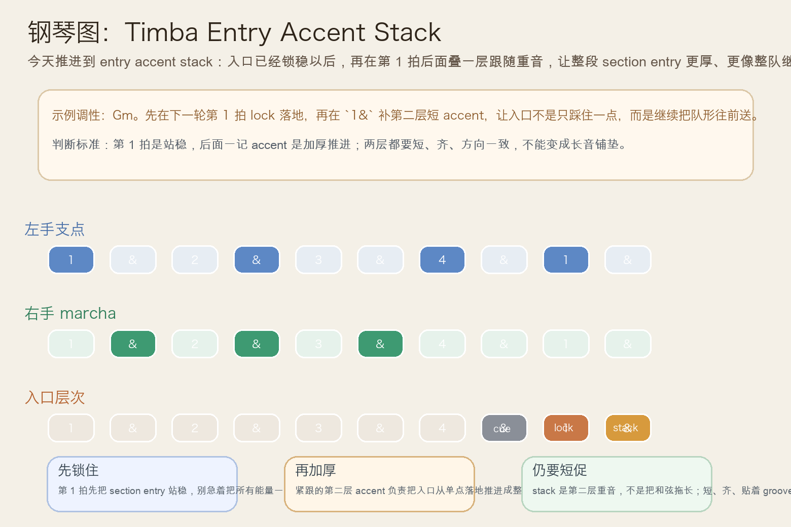
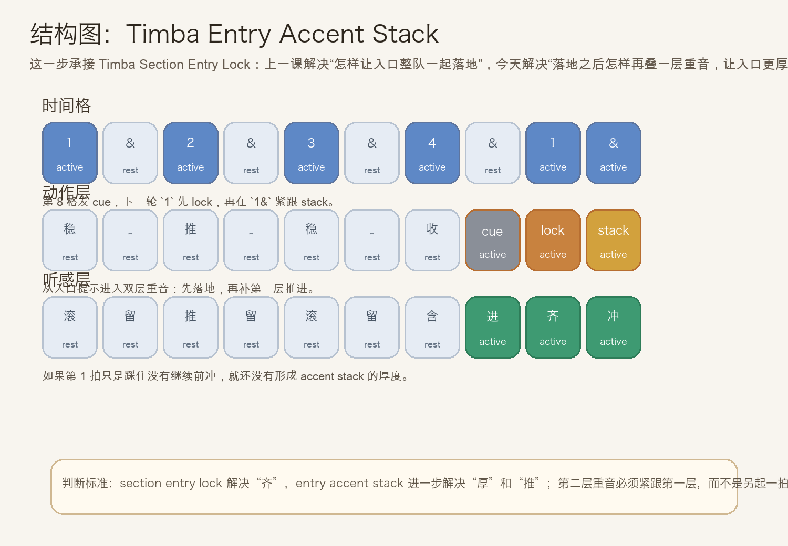
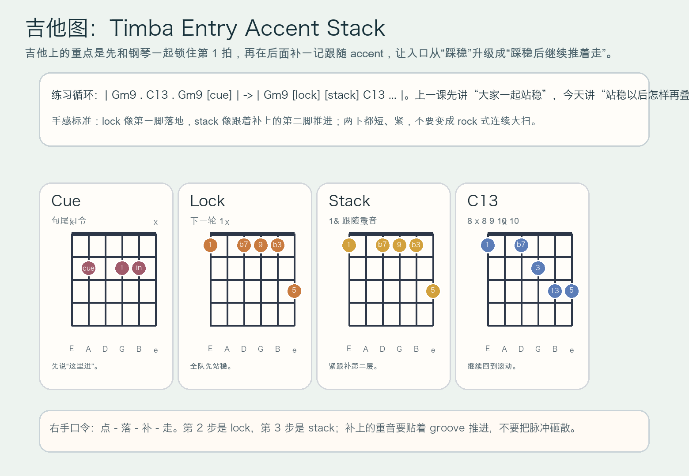

# 2026-07-14：Timba Entry Accent Stack

## 今日知识点

今天只讲一个知识点：**Timba Entry Accent Stack，也就是在 `Timba Section Entry Lock` 已经把下一轮第 1 拍锁稳之后，再叠一层紧跟着的入口重音，让整段 section entry 更厚、更有继续推进的编队感。**

上一课的 `Timba Section Entry Lock` 讲的是：句尾 cue 发出以后，钢琴和吉他怎样在下一轮第 1 拍一起短、齐、稳地落下，把入口真正锁住。

今天再往前推进一步：

**如果入口已经锁住了，怎样让它不只是“踩到了”，而是“踩到之后还继续往前推”？**

答案就是 `entry accent stack`。

你可以先把它理解成：

```text
Timba Section Entry Lock：大家在下一轮第 1 拍一起站稳
Timba Entry Accent Stack：站稳以后，再叠一层紧跟着的重音，把入口做得更厚、更有推进感
```

它的关键不在“更响”，而在：

1. 第一层 `lock` 先负责着陆，不能省掉。
2. 第二层 `stack` 必须紧跟第一层，像补上一脚推进，而不是拖成长音。
3. 钢琴、吉他和低音的方向要一致，不然只会变成零散重拍。
4. 学会它以后，你会更容易听出 Timba 编配里那些“入口像一整排人连续踏下去”的厚度感。

今天真正要抓住的是：

**Timba Entry Accent Stack 的核心，不是把入口拉长，而是在已经锁住的入口后面，再补一层短促、同向的重音。**





## 钢琴使用场景

钢琴上，`Timba Entry Accent Stack` 很适合放在 **句尾 cue 已经清楚、下一轮第 1 拍也已经能锁稳，这时想让新段落入口不只是落地，而是继续往前推进** 的场景里。

今天用 `G` 小调做一个入门版循环：

```text
前半轮：Gm9 . C13 . Gm9 . cue
下一轮：Gm9 在第 1 拍 lock 落地，然后在 `1&` 再补一记短 accent
```

钢琴上最关键的是三件事：

1. 左手第 1 拍必须先把地板踩稳，不能一开始就把第二层推进混进去。
2. 右手 `stack` 要贴着 `lock`，像“落地之后顺势再推一下”。
3. 第二层重音仍然要短，落完就回到 marcha 呼吸，不能拖成厚和弦垫底。

它尤其适合这样练：

- 先弹两轮普通 marcha，只保留稳定滚动。
- 第三轮加入 `cross-stick cue -> section entry lock`。
- 第四轮在第 1 拍落稳后，再在 `1&` 叠一层短 accent。

## 吉他使用场景

吉他上，`Timba Entry Accent Stack` 很适合放在 **高位 comping 已经能把段落入口锁实，接下来想把整队进入的感觉做得更厚、更像编配层层压上来** 的场景里。

今天可以直接套这个思路：

```text
| Gm9 . C13 . Gm9 [cue] | -> | Gm9 [lock] [stack] C13 ... |
重点：先踩稳，再顺手补第二脚，不要把两下并成一块长扫弦
```

吉他的重点是：

1. `lock` 这一下仍然是入口的主着陆点。
2. `stack` 要紧跟着补上，像给入口加一层厚度，而不是另起一轮节奏。
3. 第 2 下重音之后要立刻回到正常 comping，不然整个 groove 会变硬、变笨重。

最常见的错误是：

- 一开始就只顾着第 2 下，结果第 1 拍反而没锁稳。
- 两下都弹得太长，听起来像连着扫两大拍。
- `stack` 来得太晚，失去“入口重音叠层”的效果。



## 可演奏例子

钢琴例子：

```text
例子 1（先保留上一课）
左手：G . . . G . . .
右手：marcha -> cue -> lock
要求：先确认第 1 拍真的已经短、齐、稳地落下。

例子 2（加入第二层）
左手：G . . . G . . . | G .
右手：marcha -> cue | lock -> stack
要求：`stack` 要紧跟 `lock`，像入口着陆后顺势再推一下。

例子 3（比较两种入口厚度）
第一轮：只有 section entry lock
第二轮：lock 之后再补一层 stack
要求：听出第二轮比第一轮更像“整队落地后继续往前顶”。
```

吉他例子：

```text
例子 1（纯右手动作）
口令：点 - 落 - 补 - 走
要求：`落` 是第 1 拍 lock，`补` 是紧跟的 stack。

例子 2（带和弦）
和声：| Gm9 . C13 . Gm9 [cue] | -> | Gm9 [lock] [stack] C13 ... |
要求：第 2 下比第 1 下轻一点，但方向更明确，像把入口继续送出去。

例子 3（接上昨天主题）
第一轮：只做 section entry lock
第二轮：保留 lock，再叠一层 stack
要求：比较“只是站稳”与“站稳后继续推进”的差别。
```

## 今日练习

1. 先拍手数 `1 & 2 & 3 & 4 & | 1 &`，把 `4 &` 拍成 cue，把 `1` 拍成 lock，把 `1&` 拍成 stack。
2. 钢琴先练两分钟 `Gm9 -> C13` 的普通 marcha，再加入一句 `cue -> lock -> stack` 入口。
3. 吉他先全闷音练右手口令 `点 - 落 - 补 - 走`，确认第 2 下不是更长，而是更贴、更稳。
4. 把 `Timba Cross-Stick Cue`、`Timba Section Entry Lock`、`Timba Entry Accent Stack` 连起来：先把入口说清楚，再整队落地，最后把落地后的推进感叠出来。
5. 录一段自己的循环，回听 `stack` 是否真的紧贴 `lock`，并且让入口更厚，而不是把 groove 打散。

## 一句话总结

Timba Entry Accent Stack 的核心，是在 section entry 已经锁稳之后，再补一层紧跟着的短重音，让入口从“齐整着陆”升级成“着陆后继续推进”。
