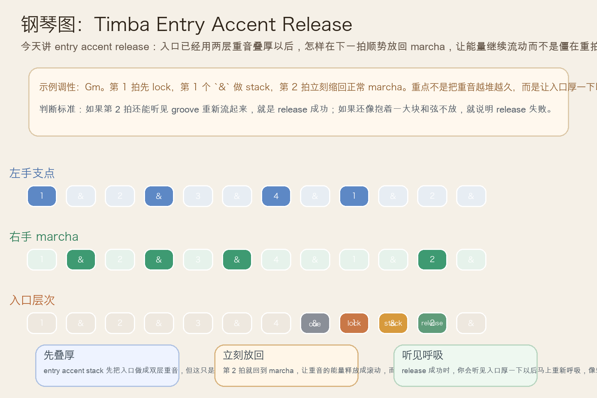
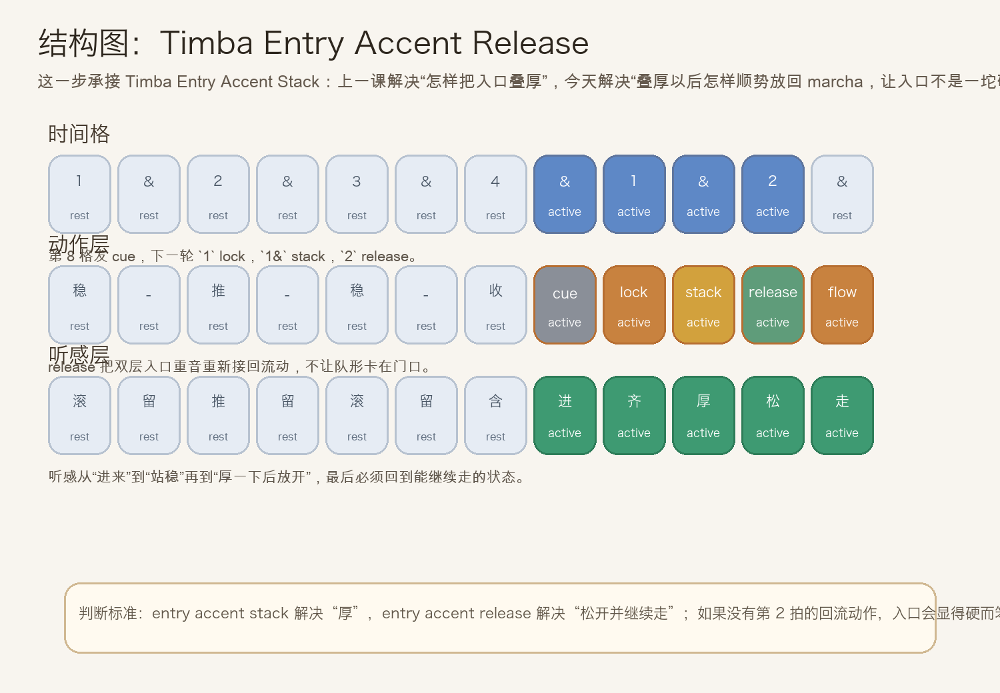
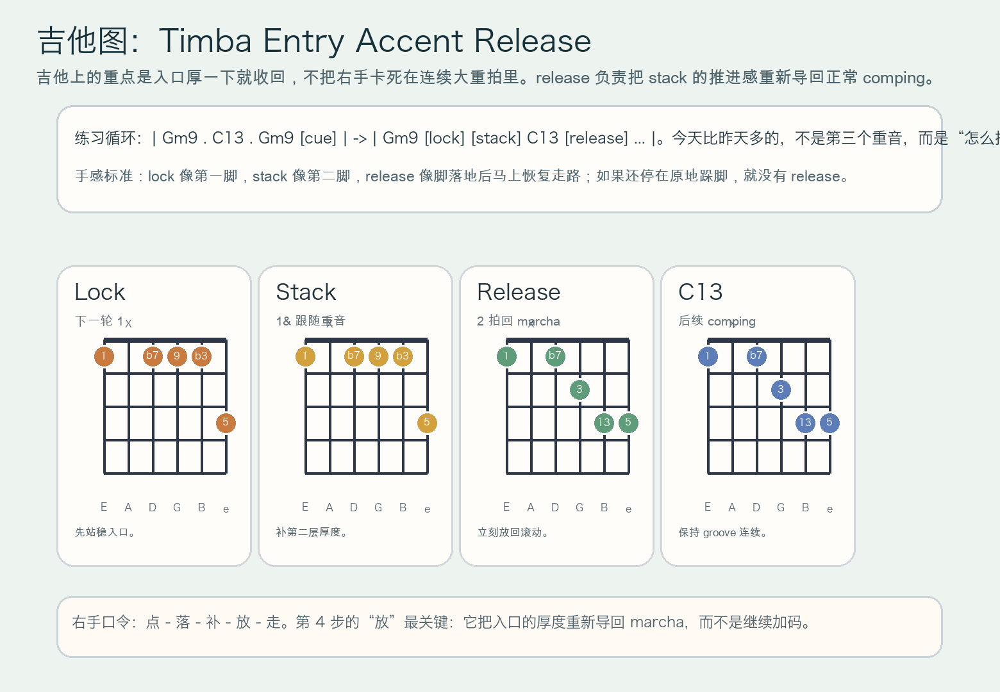

# 2026-07-15：Timba Entry Accent Release

## 今日知识点

今天只讲一个知识点：**Timba Entry Accent Release，也就是在 `Timba Entry Accent Stack` 已经把入口叠成两层重音之后，怎样立刻把能量放回正常 marcha，让入口厚一下以后还能继续流动，而不是卡成僵硬重拍。**

上一课的 `Timba Entry Accent Stack` 讲的是：入口先 lock 落地，再补一层紧跟着的 stack，让整个 section entry 更厚、更有推进感。

今天再往前推进一步：

**如果入口已经叠厚了，怎样避免它变成“砸完两下就僵住”的重拍？**

答案就是 `entry accent release`。

你可以先把它理解成：

```text
Timba Entry Accent Stack：入口先落地，再补第二层重音
Timba Entry Accent Release：第二层重音之后，立刻放回 marcha，让 groove 重新流起来
```

它的关键不在“再多一个重音”，而在：

1. `lock` 和 `stack` 只负责把入口做厚，不负责一直占住后面的拍子。
2. `release` 必须及时，通常就在下一拍或下一次正常 comping 上体现出来。
3. 钢琴、吉他和低音要一起从“入口重音模式”切回“滚动推进模式”。
4. 学会它以后，你会更容易听出 Timba 里那些入口为什么厚一下就马上继续往前跑，而不是停在门口。

今天真正要抓住的是：

**Timba Entry Accent Release 的核心，不是把入口继续堆下去，而是在入口叠厚之后，马上把重音的能量导回正常 groove。**





## 钢琴使用场景

钢琴上，`Timba Entry Accent Release` 很适合放在 **句尾 cue 已经清楚、下一轮入口也已经 lock + stack 叠厚，这时需要把整段重新送回 marcha，而不是把入口做成一块笨重厚和弦** 的场景里。

今天用 `G` 小调做一个入门版循环：

```text
前半轮：Gm9 . C13 . Gm9 . cue
下一轮：Gm9 在第 1 拍 lock，`1&` 做 stack，第 2 拍立刻回到 marcha
```

钢琴上最关键的是三件事：

1. 左手低音要继续给地板，不能因为入口叠厚就把后面的滚动停住。
2. 右手 `release` 要有“收回去继续走”的感觉，而不是“前面两下打完后发呆”。
3. 第 2 拍恢复 marcha 时，触键要比 `lock` 和 `stack` 轻一些，但时间必须更准。

它尤其适合这样练：

- 先弹两轮普通 marcha，只保留稳定滚动。
- 第三轮加入 `cue -> lock -> stack`。
- 第四轮在 `stack` 之后，要求自己第 2 拍马上恢复普通 marcha 呼吸。

## 吉他使用场景

吉他上，`Timba Entry Accent Release` 很适合放在 **高位 comping 已经能做出入口厚度，接下来想让整个段落不是“跺完两脚就站住”，而是“跺完两脚继续往前走”** 的场景里。

今天可以直接套这个思路：

```text
| Gm9 . C13 . Gm9 [cue] | -> | Gm9 [lock] [stack] C13 [release] ... |
重点：前两下负责入口厚度，后一下负责恢复流动
```

吉他的重点是：

1. `lock` 和 `stack` 还是入口主角，但 `release` 决定 groove 会不会僵。
2. `release` 不是第三个更大的重拍，而是把右手重新带回正常摆动。
3. `stack` 之后如果还继续按着一大块和弦不放，听感就会像卡住，而不是 release。

最常见的错误是：

- 前两下做得很厚，但第 2 拍没回到 comping。
- 以为 release 也要更重，结果变成三连重拍。
- 右手动作恢复得太晚，让整个入口像硬切片段，而不是顺着带进下一轮。



## 可演奏例子

钢琴例子：

```text
例子 1（先保留上一课）
左手：G . . . G . . .
右手：marcha -> cue | lock -> stack
要求：先确认昨天那种“入口两层重音”已经稳定。

例子 2（加入 release）
左手：G . . . G . . . | G . C .
右手：marcha -> cue | lock -> stack -> marcha
要求：第 2 拍要明显回到滚动，不要还挂在重音里。

例子 3（比较两种入口结果）
第一轮：只有 lock + stack，没有及时回 marcha
第二轮：lock + stack 之后立刻 release
要求：听出第二轮更像“入口厚一下以后整队继续往前跑”。
```

吉他例子：

```text
例子 1（纯右手动作）
口令：点 - 落 - 补 - 放 - 走
要求：第 4 步“放”不是停，而是把手感重新接回 comping。

例子 2（带和弦）
和声：| Gm9 . C13 . Gm9 [cue] | -> | Gm9 [lock] [stack] C13 [release] ... |
要求：`release` 比前两下轻，但拍点更清楚。

例子 3（接上昨天主题）
第一轮：只做 entry accent stack
第二轮：保留 stack，再加入下一拍的 release
要求：比较“入口很厚”与“入口厚完还能继续流”的区别。
```

## 今日练习

1. 先拍手数 `1 & 2 & 3 & 4 & | 1 & 2 &`，把 `4&` 拍成 cue，把 `1` 拍成 lock，把 `1&` 拍成 stack，把 `2` 拍成 release。
2. 钢琴先练两分钟 `Gm9 -> C13` 的普通 marcha，再加入一句 `cue -> lock -> stack -> release`。
3. 吉他先全闷音练右手口令 `点 - 落 - 补 - 放 - 走`，确认“放”不是停顿，而是恢复流动。
4. 把 `Timba Section Entry Lock`、`Timba Entry Accent Stack`、`Timba Entry Accent Release` 连起来：先落稳，再叠厚，最后放回 groove。
5. 录一段自己的循环，回听第 2 拍是否真的比前两下更像正常 marcha，而不是第三个重拍。

## 一句话总结

Timba Entry Accent Release 的核心，是在入口已经 lock + stack 叠厚之后，立刻把重音能量导回 marcha，让段落从“厚重入场”顺势回到“持续推进”。
