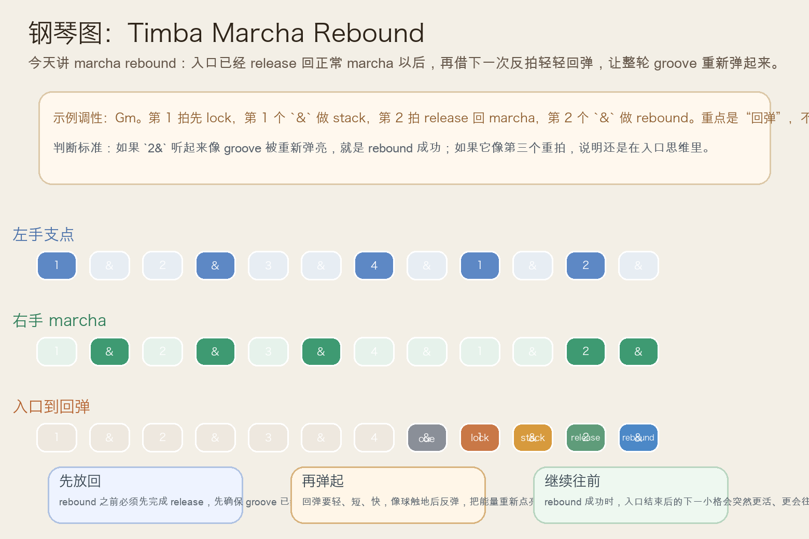
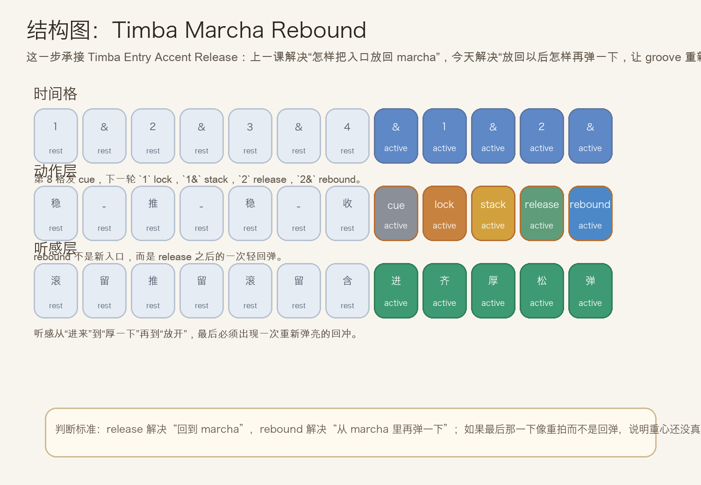
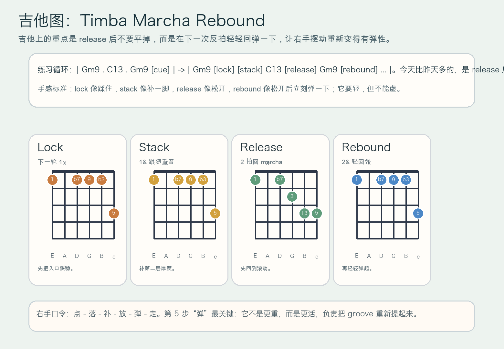

# 2026-07-16：Timba Marcha Rebound

## 今日知识点

今天只讲一个知识点：**Timba Marcha Rebound，也就是在 `Timba Entry Accent Release` 已经把入口重音放回正常 marcha 之后，怎样借下一次反拍或短促回弹，把整轮 groove 再弹起来。**

上一课的 `Timba Entry Accent Release` 讲的是：入口先 `lock + stack` 叠厚，然后在下一拍立刻放回 marcha，让段落不要僵在重拍上。

今天再往前推进一步：

**如果已经放回 marcha，怎样让它不只是“恢复正常”，而是“恢复以后马上带出新的弹性和前冲感”？**

答案就是 `marcha rebound`。

你可以先把它理解成：

```text
Timba Entry Accent Release：入口厚完后，立刻放回正常 marcha
Timba Marcha Rebound：放回 marcha 以后，再借下一次反拍把 groove 弹起来
```

它的关键不在“再加一个重拍”，而在：

1. `release` 先负责回到正常滚动，不能省掉。
2. `rebound` 要更轻、更弹，像回弹，不像再砸一脚。
3. 钢琴、吉他和低音都要把重心从“入口处理”切回“持续推进”。
4. 学会它以后，你会更容易听出 Timba 里那些入口结束后，整个乐队为什么会突然重新变得很弹、很会往前跑。

今天真正要抓住的是：

**Timba Marcha Rebound 的核心，不是继续堆入口重音，而是在 release 之后，用一次回弹把 groove 的前冲感重新点亮。**





## 钢琴使用场景

钢琴上，`Timba Marcha Rebound` 很适合放在 **句尾 cue 已经清楚、入口也已经完成 `lock -> stack -> release`，这时你不想只是平淡地回到 marcha，而是想让右手在下一次反拍上重新弹一下，把段落继续推走** 的场景里。

今天用 `Gm9 -> C13` 做一个入门版循环：

```text
前半轮：Gm9 . C13 . Gm9 . cue
下一轮：1 拍 lock，1& stack，2 拍 release，2& 或 3 拍前半格做 rebound
```

钢琴上最关键的是三件事：

1. 左手低音要保持地板连续，不能因为 rebound 又回到重拍思维。
2. 右手 `release` 要先回到正常 marcha，再从里面弹出一记更轻的回弹。
3. `rebound` 要短、快、带方向，像球落地后弹起，而不是重新压住和弦。

它尤其适合这样练：

- 先弹两轮普通 marcha，只保留稳定滚动。
- 第三轮加入 `cue -> lock -> stack -> release`。
- 第四轮在 `release` 后，再把下一次反拍做成更轻、更弹的 rebound。

## 吉他使用场景

吉他上，`Timba Marcha Rebound` 很适合放在 **高位 comping 已经完成入口厚度和释放，接下来想让右手恢复到有弹性的摆动，而不是回到平平的刷法** 的场景里。

今天可以直接套这个思路：

```text
| Gm9 . C13 . Gm9 [cue] | -> | Gm9 [lock] [stack] C13 [release] Gm9 [rebound] ... |
重点：rebound 是“放回去以后再弹一下”，不是“再补一记大重拍”
```

吉他的重点是：

1. `rebound` 必须建立在已经 release 的前提上，否则会像第三个重拍。
2. 右手回弹动作要更像短促上扬，不是继续往下压。
3. 回弹之后要立刻继续正常 comping，让 groove 保持连贯。

最常见的错误是：

- `release` 还没站稳，就急着把 rebound 打得很重。
- 误把 rebound 当成新一轮 lock，结果又把重心拉回第 1 拍。
- 回弹之后没有继续走，让整句像“厚一下、放一下、又卡一下”。



## 可演奏例子

钢琴例子：

```text
例子 1（先保留昨天内容）
左手：G . . . G . . .
右手：marcha -> cue | lock -> stack -> release
要求：先确认第 2 拍已经顺利放回滚动。

例子 2（加入 rebound）
左手：G . . . G . C . 
右手：marcha -> cue | lock -> stack -> release -> rebound
要求：rebound 要更轻，但能明显把 groove 再往前弹一下。

例子 3（比较两种恢复结果）
第一轮：release 后直接平着回 marcha
第二轮：release 后加一个 rebound
要求：听出第二轮更有“重新弹起来”的前冲感。
```

吉他例子：

```text
例子 1（纯右手动作）
口令：点 - 落 - 补 - 放 - 弹 - 走
要求：第 5 步“弹”是回弹，不是加重。

例子 2（带和弦）
和声：| Gm9 . C13 . Gm9 [cue] | -> | Gm9 [lock] [stack] C13 [release] Gm9 [rebound] ... |
要求：`rebound` 比 `release` 更短、更轻，但时间更有弹性。

例子 3（接上最近三课）
第一轮：section entry lock
第二轮：lock + stack
第三轮：lock + stack + release + rebound
要求：比较“锁住”“叠厚”“放回”“弹起”四种层次。
```

## 今日练习

1. 先拍手数 `1 & 2 & 3 & 4 & | 1 & 2 & 3 &`，把 `4&` 拍成 cue，把 `1` 拍成 lock，把 `1&` 拍成 stack，把 `2` 拍成 release，把 `2&` 拍成 rebound。
2. 钢琴先练两分钟 `Gm9 -> C13` 的普通 marcha，再加入一句 `cue -> lock -> stack -> release -> rebound`。
3. 吉他先全闷音练右手口令 `点 - 落 - 补 - 放 - 弹 - 走`，确认“弹”是轻快回弹，不是第三个大重拍。
4. 把 `Timba Entry Accent Stack`、`Timba Entry Accent Release`、`Timba Marcha Rebound` 连起来：先叠厚，再放回，最后再弹起。
5. 录一段自己的循环，回听 `rebound` 是否真的让 groove 更弹，而不是把入口又做厚一次。

## 一句话总结

Timba Marcha Rebound 的核心，是在入口重音已经 release 回 marcha 之后，用一次更轻、更弹的回弹把 groove 再次点亮，让段落继续往前跑。
