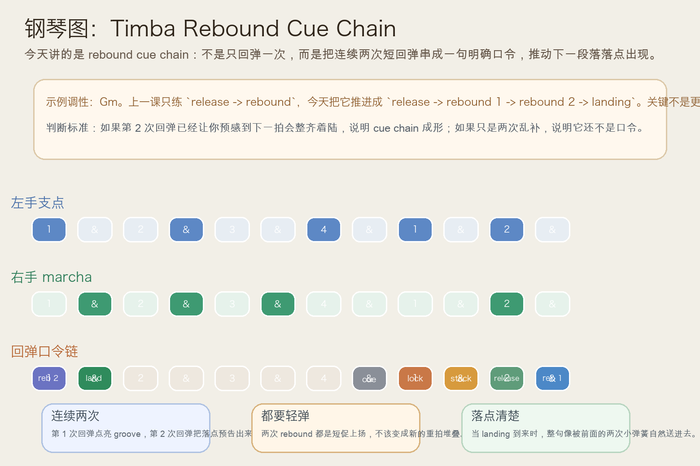
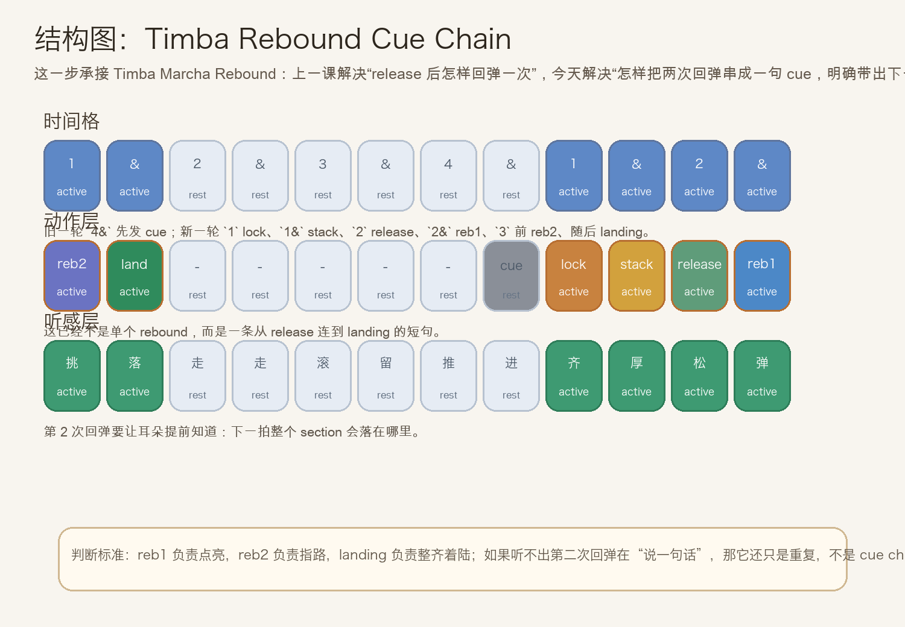
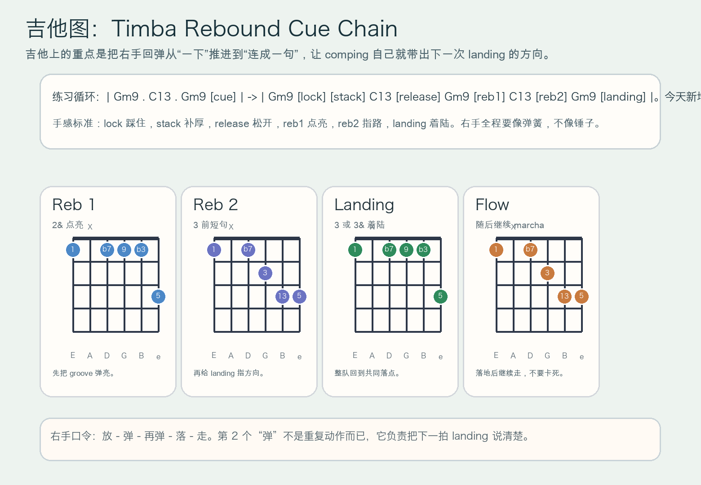

# 2026-07-17：Timba Rebound Cue Chain

## 今日知识点

今天只讲一个知识点：**Timba Rebound Cue Chain，也就是在 `Timba Marcha Rebound` 已经会做一次回弹之后，怎样把连续两次短回弹串成一句更明确的口令，带出下一次 landing。**

上一课的重点，是：

```text
release -> rebound
先放回 marcha，再轻轻弹一下
```

今天再往前推进一步：

```text
release -> rebound 1 -> rebound 2 -> landing
先弹亮，再指路，最后整齐着陆
```

这一步的关键不是“多打一记”，而是：

1. 第一次 rebound 负责把 groove 重新点亮。
2. 第二次 rebound 负责让大家提前听见下一拍要落在哪里。
3. landing 一来，钢琴、吉他和低音会像被前面两次小弹簧自然送进去。
4. 学会它以后，你会更容易听出 Timba 编配里那些“不是只回弹一次，而是连续两下把乐队带回段落”的口令。

今天真正要抓住的是：

**Timba Rebound Cue Chain 的核心，不是连续补重音，而是用两次轻快回弹形成一句有方向的 cue。**





## 钢琴使用场景

钢琴上，`Timba Rebound Cue Chain` 很适合放在 **入口已经完成 `lock -> stack -> release`，第一下 rebound 也已经把 groove 弹亮，这时你想再用第二下短句明确提示“下一拍大家一起落这里”** 的场景里。

今天用 `Gm9 -> C13` 做一个入门版循环：

```text
前半轮：Gm9 . C13 . Gm9 . cue
下一轮：1 拍 lock，1& stack，2 拍 release，2& rebound 1，3 前半格 rebound 2，3 或 3& landing
```

钢琴上最关键的是三件事：

1. 左手低音要继续像地板一样稳定，不能因为连续两次 rebound 就开始乱抬。
2. 右手第一次 rebound 要轻快，第二次 rebound 要更像“指方向”的短句，而不是简单重复。
3. landing 到来时要整齐落下，但落完马上继续 marcha，不要把整句做成僵硬终止。

你可以这样练：

- 先弹两轮普通 marcha，只让右手稳定滚动。
- 第三轮加入 `cue -> lock -> stack -> release -> rebound 1`。
- 第四轮再补上 `rebound 2 -> landing`，听它是不是已经变成一句完整口令。

## 吉他使用场景

吉他上，`Timba Rebound Cue Chain` 很适合放在 **高位 comping 已经从入口重音放回正常摆动，这时右手不想只弹一下就结束，而是想连续两下把全队带回共同落点** 的场景里。

今天可以直接套这个思路：

```text
| Gm9 . C13 . Gm9 [cue] | -> | Gm9 [lock] [stack] C13 [release] Gm9 [reb1] C13 [reb2] Gm9 [landing] |
重点：reb2 不是重复 reb1，而是让 landing 更早被听出来
```

吉他的重点是：

1. `reb1` 负责点亮 groove，`reb2` 负责说明下一拍落点。
2. 两次 rebound 都要像短促上扬，不能像往下压的重刷。
3. landing 之后右手要立刻继续 comping，让乐句保持流动。

最常见的错误是：

- 第一记 rebound 很轻，第二记却突然打成大重拍。
- `reb2` 没有方向，听起来只是“又补了一下”。
- landing 之后停住不走，结果整句不像 cue，反而像卡顿。



## 可演奏例子

钢琴例子：

```text
例子 1（先练一句单回弹）
左手：G . . . G . . .
右手：marcha -> cue | lock -> stack -> release -> rebound 1
要求：确认第 1 次 rebound 已经把 groove 弹亮。

例子 2（补成 cue chain）
左手：G . . . G . C .
右手：marcha -> cue | lock -> stack -> release -> rebound 1 -> rebound 2 -> landing
要求：第 2 次 rebound 要让你提前听见 landing 会到来。

例子 3（比较两种结果）
第一轮：release 后只有一次 rebound
第二轮：release 后做成 rebound cue chain
要求：听出第二轮更像“整句提示”，而不是单点回弹。
```

吉他例子：

```text
例子 1（纯右手动作）
口令：放 - 弹 - 再弹 - 落 - 走
要求：第二个“弹”必须更像指路，而不是更重。

例子 2（带和弦）
和声：| Gm9 . C13 . Gm9 [cue] | -> | Gm9 [lock] [stack] C13 [release] Gm9 [reb1] C13 [reb2] Gm9 [landing] |
要求：landing 要像被前面两次 rebound 自然送进去。

例子 3（接上最近两课）
第一轮：entry accent release
第二轮：marcha rebound
第三轮：rebound cue chain
要求：比较“放回”“弹亮”“指路着陆”三层功能。
```

## 今日练习

1. 先拍手数 `1 & 2 & 3 & 4 & | 1 & 2 & 3 &`，把 `4&` 拍成 cue，把 `1` 拍成 lock，把 `1&` 拍成 stack，把 `2` 拍成 release，把 `2&` 拍成 rebound 1，把 `3` 前半格拍成 rebound 2。
2. 钢琴先练两分钟 `Gm9 -> C13` 的普通 marcha，再加入一句 `cue -> lock -> stack -> release -> rebound 1 -> rebound 2 -> landing`。
3. 吉他先全闷音练右手口令 `放 - 弹 - 再弹 - 落 - 走`，确认第二个“弹”是在指方向，不是在加重量。
4. 把 `Timba Entry Accent Release`、`Timba Marcha Rebound`、`Timba Rebound Cue Chain` 连起来，体会“先放回，再弹亮，再带着陆”的递进。
5. 录一段自己的循环，回听第二次 rebound 是否真的让 landing 更早被听出来。

## 一句话总结

Timba Rebound Cue Chain 的核心，是在第一次 rebound 点亮 groove 之后，再用第二次轻快回弹把 landing 的方向说清楚，让整句像口令一样自然把乐队送进下一拍。
