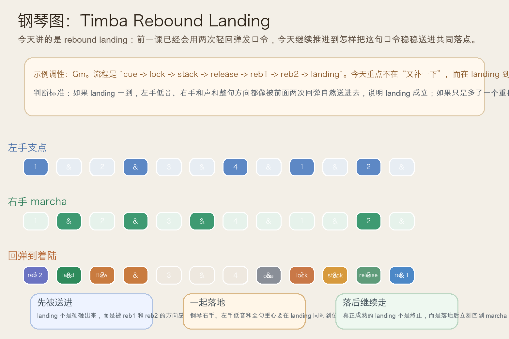
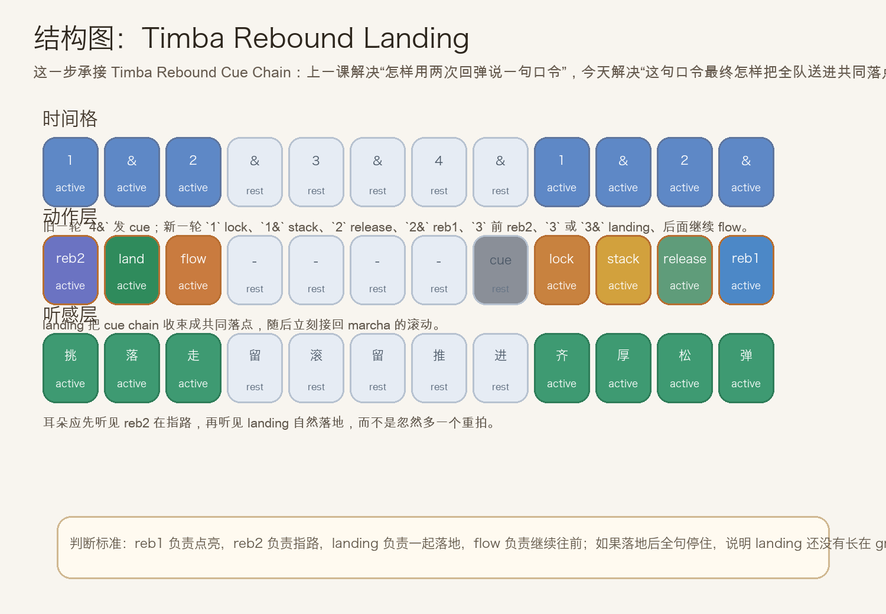
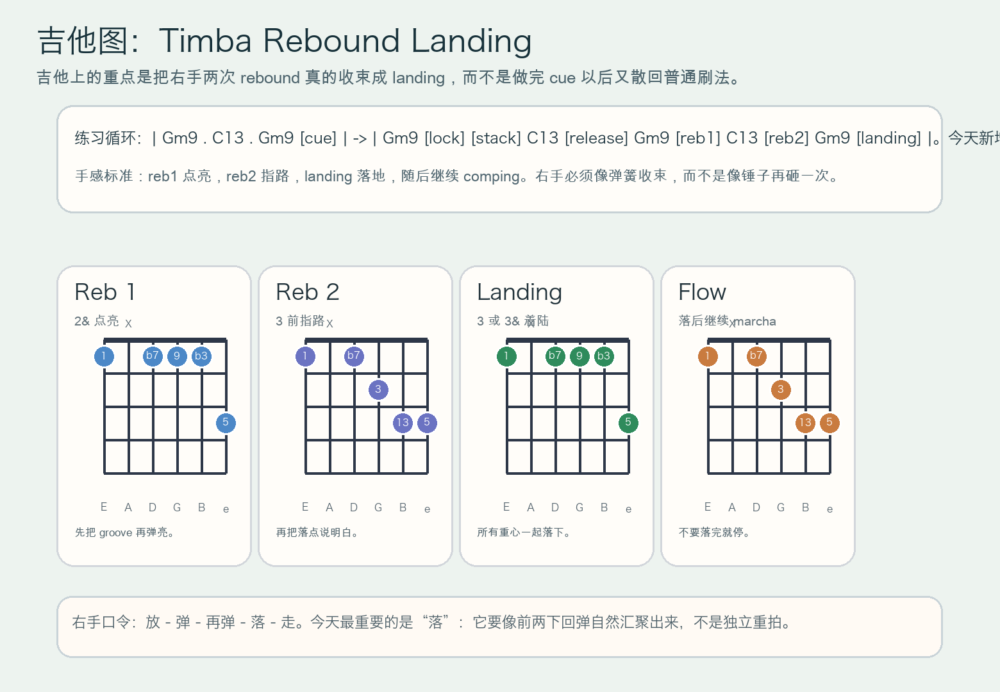

# 2026-07-20：Timba Rebound Landing

## 今日知识点

今天只讲一个知识点：**Timba Rebound Landing，也就是在 `Timba Rebound Cue Chain` 已经会用两次轻回弹形成口令之后，怎样把这句口令稳稳送进共同落点，并且落地后继续推进。**

上一课的重点是：

```text
release -> rebound 1 -> rebound 2 -> landing
先弹亮，再指路，最后把落点说出来
```

今天再往前推进一步：

```text
release -> rebound 1 -> rebound 2 -> landing -> flow
不只是落下，而且落下后马上继续 marcha
```

这一步真正关键的，不是“多一个 landing”，而是：

1. `rebound 1` 负责把 groove 再点亮。
2. `rebound 2` 负责让大家提前听见落点。
3. `landing` 负责把钢琴、吉他和低音一起送进共同拍点。
4. `flow` 负责证明这不是终止，而是落地以后继续滚动。

今天真正要抓住的是：

**Timba Rebound Landing 的核心，不是再补一个重拍，而是让前面两次回弹自然汇聚成一次整齐着陆，并且落地后 groove 继续往前走。**





## 钢琴使用场景

钢琴上，`Timba Rebound Landing` 很适合放在 **入口已经完成 `lock -> stack -> release`，两次 rebound 也已经把方向说清楚，这时你想让全句不是悬在那里，而是在某个共同拍点上稳稳落地，同时又不失去 marcha 推进感** 的场景里。

今天用 `Gm9 -> C13` 做一个入门版循环：

```text
前半轮：Gm9 . C13 . Gm9 . cue
下一轮：1 拍 lock，1& stack，2 拍 release，2& rebound 1，3 前半格 rebound 2，3 或 3& landing，随后继续 marcha
```

钢琴上最关键的是三件事：

1. 左手低音要像地板一样稳定，landing 到来时不能抢拍或突然停住。
2. 右手必须把 `reb1 -> reb2 -> landing` 听成一整句，而不是三个互不相关的动作。
3. landing 落下以后要立刻回到正常 marcha，让听感是“落地继续跑”，不是“落地就结束”。

你可以这样练：

- 先弹两轮普通 marcha，只让右手保持滚动。
- 第三轮加入 `cue -> lock -> stack -> release -> rebound 1 -> rebound 2`。
- 第四轮补上 `landing -> flow`，专门听 landing 是否真的把整句收束好了。

## 吉他使用场景

吉他上，`Timba Rebound Landing` 很适合放在 **高位 comping 已经通过两次回弹把落点预告出来，这时右手需要把这句 cue 真正收进共同着陆，而不是又散回普通刷法** 的场景里。

今天可以直接套这个思路：

```text
| Gm9 . C13 . Gm9 [cue] |
-> | Gm9 [lock] [stack] C13 [release] Gm9 [reb1] C13 [reb2] Gm9 [landing] ... |
重点：landing 是前两下回弹自然汇聚出来的共同落点，不是独立的大重拍
```

吉他的重点是：

1. `reb1` 点亮 groove，`reb2` 说清方向，`landing` 才把大家带到同一拍。
2. landing 的右手动作要短、稳、齐，不能因为想强调而压得过重。
3. landing 之后要立刻继续 comping，否则整句会像断掉，而不是推进。

最常见的错误是：

- `reb2` 已经说清了方向，但 landing 还是打得太猛，听起来像重新砸一次。
- landing 落点不齐，左手和右手没有同时到位。
- landing 后停住不走，结果整句变成“收尾”，失去 Timba 持续滚动感。



## 可演奏例子

钢琴例子：

```text
例子 1（先练 cue chain）
左手：G . . . G . . .
右手：marcha -> cue | lock -> stack -> release -> rebound 1 -> rebound 2
要求：先确认第 2 次 rebound 已经明确指向下一拍。

例子 2（补成 landing）
左手：G . . . G . C .
右手：marcha -> cue | lock -> stack -> release -> rebound 1 -> rebound 2 -> landing -> flow
要求：landing 到来时，左右手要像被前面两次回弹自然送进去。

例子 3（比较两种结果）
第一轮：做到 rebound cue chain 就停
第二轮：做成 rebound landing 并继续 marcha
要求：听出第二轮更像“整队落地后继续前冲”。
```

吉他例子：

```text
例子 1（纯右手动作）
口令：放 - 弹 - 再弹 - 落 - 走
要求：“落”必须像前两下汇聚出来，不是单独大重拍。

例子 2（带和弦）
和声：| Gm9 . C13 . Gm9 [cue] | -> | Gm9 [lock] [stack] C13 [release] Gm9 [reb1] C13 [reb2] Gm9 [landing] ... |
要求：landing 落点短而齐，随后立刻恢复 comping。

例子 3（接上最近三课）
第一轮：marcha rebound
第二轮：rebound cue chain
第三轮：rebound landing
要求：比较“弹亮”“指路”“落地继续走”三层功能。
```

## 今日练习

1. 先拍手数 `1 & 2 & 3 & 4 & | 1 & 2 & 3 &`，把 `4&` 拍成 cue，把 `1` 拍成 lock，把 `1&` 拍成 stack，把 `2` 拍成 release，把 `2&` 拍成 rebound 1，把 `3` 前半格拍成 rebound 2，把 `3` 或 `3&` 拍成 landing。
2. 钢琴先练两分钟 `Gm9 -> C13` 的普通 marcha，再加入一句 `cue -> lock -> stack -> release -> rebound 1 -> rebound 2 -> landing -> flow`。
3. 吉他先全闷音练右手口令 `放 - 弹 - 再弹 - 落 - 走`，确认“落”是收束感，不是新增一脚重拍。
4. 把 `Timba Marcha Rebound`、`Timba Rebound Cue Chain`、`Timba Rebound Landing` 连起来，体会“先弹亮，再指路，最后落地继续走”的递进。
5. 录一段自己的循环，回听 landing 之后 groove 是否立刻恢复滚动；如果落完就停，说明 landing 还不成熟。

## 一句话总结

Timba Rebound Landing 的核心，是把两次轻回弹自然汇聚成一次共同着陆，并在着陆后立刻继续 marcha，让 groove 落地却不停步。
